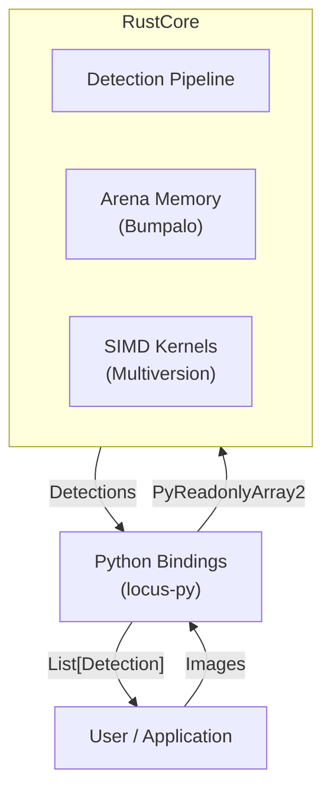
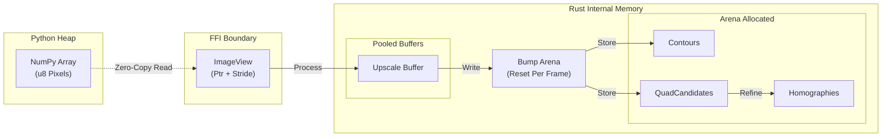
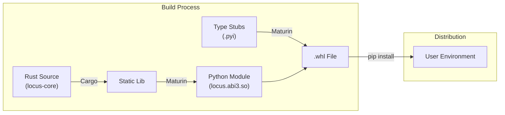

# Architecture & Patterns

## 1. Data-Oriented Design
* **Data Layer:** Zero-copy `PyReadonlyArray2<u8>`. Validate strides before unsafe SIMD.
* **Preprocessing:** Tile-based adaptive thresholding with `multiversion` kernels.
* **Segmentation:** Flat array Union-Find (Cache Locality).
* **Quad Fitting:** Gradient-based refinement using stack-allocated `nalgebra::SMatrix`.

## 2. System Overview

## 3. Key Invariants
* **Zero Alloc in Hot Loop:** Use `bumpalo::Bump` arenas.
* **No Branching:** Use masks/CMOVs in pixel loops.

## 4. Memory Architecture

## 5. Packaging & Distribution

