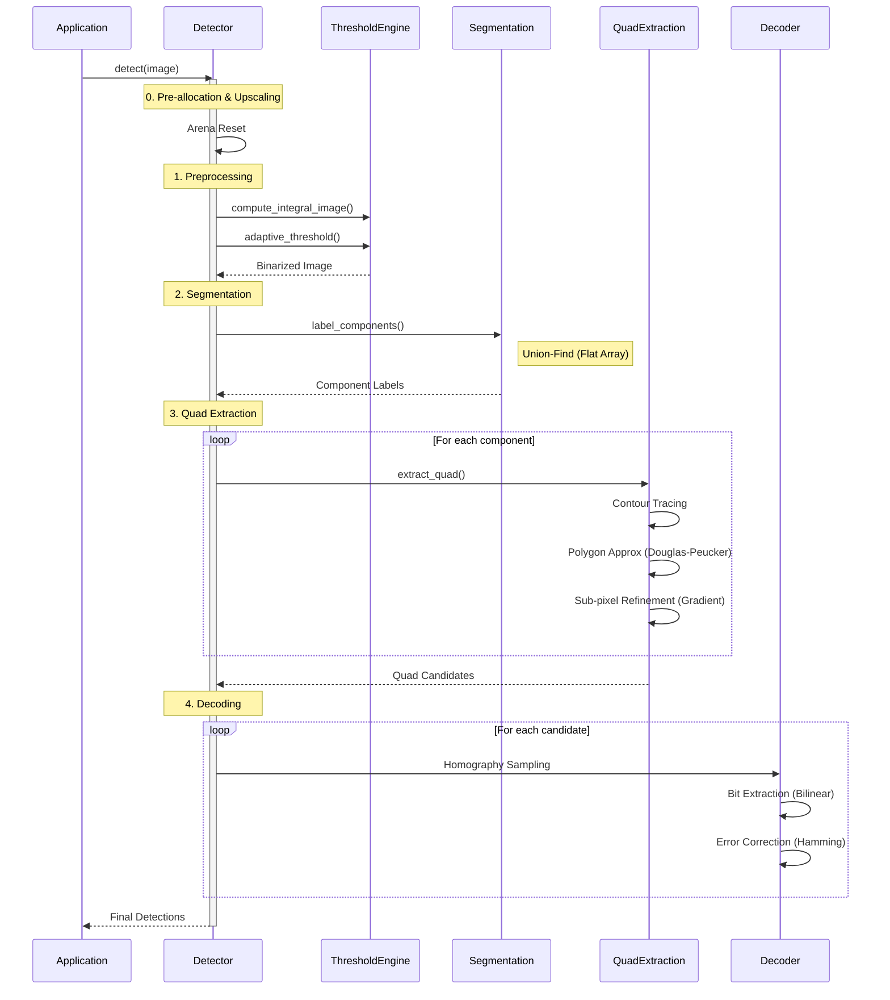
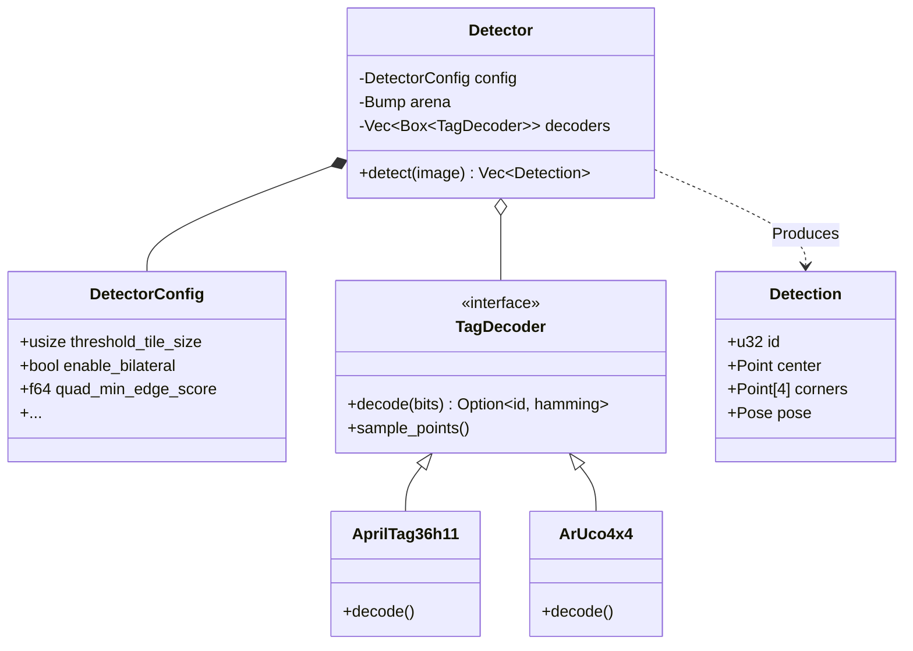

# System Architecture

This document provides a high-level overview of the Locus system architecture, designed for high-performance fiducial marker detection.

## High-Level Overview

Locus is built as a hybrid Rust/Python system. The core logic resides in a high-performance Rust crate (`locus-core`), which is exposed to Python via `pyo3` bindings (`locus-py`).

```mermaid
flowchart TD
    User[User / Application] -->|Images| PyBindings[Python Bindings<br/>(locus-py)]
    PyBindings -->|PyReadonlyArray2| RustCore[Rust Core<br/>(locus-core)]
    
    subgraph RustCore
        Pipeline[Detection Pipeline]
        Memory[Arena Memory<br/>(Bumpalo)]
        SIMD[SIMD Kernels<br/>(Multiversion)]
    end
    
    RustCore -->|Detections| PyBindings
    PyBindings -->|List[Detection]| User
```

## Detection Pipeline

The detection pipeline follows a Data-Oriented Design (DOD) approach to minimize cache misses and allocation overhead. The entire hot path runs without heap allocations, using a pre-allocated arena that is reset per frame.



## Component Diagram

The system is structured around the `Detector` struct, which manages configuration and state.



## Design Principles

1.  **Zero-Copy Python Integration**: We use the Python Buffer Protocol to read NumPy arrays directly without copying pixel data.
2.  **Arena Allocation**: Per-frame scratch memory (contours, points, intermediate structs) is allocated in a `bumpalo::Bump` arena, which is mostly a pointer bump. This avoids `malloc`/`free` overhead in the hot loop.
3.  **Data Scalability**: The core algorithms (thresholding, component labeling) are designed to be cache-friendly, processing data in linear passes where possible.
4.  **SIMD Optimization**: Critical paths like thresholding and filtering use `multiversion` to dispatch to AVX2/AVX-512/NEON implementations at runtime.
5.  **Hybrid Parallelism**: The pipeline leverages `rayon` for data-parallel stages (Thresholding, Decoding) while keeping state-heavy stages (Segmentation, Quad Extraction) sequential and cache-coherent.

## Memory Architecture

Locus optimizes latency by managing memory explicitly. The critical path avoids system allocator calls (`malloc`/`free`) almost entirely.

```mermaid
flowchart LR
    subgraph Python [Python Heap]
        PyArr[NumPy Array<br/>(u8 Pixels)]
    end
    
    subgraph Interface [FFI Boundary]
        View[ImageView<br/>(Ptr + Stride)]
    end
    
    subgraph Rust [Rust Internal Memory]
        Arena[Bump Arena<br/>(Reset Per Frame)]
        
        subgraph Static [Pooled Buffers]
            Upscale[Upscale Buffer]
        end
        
        subgraph Ephemeral [Arena Allocated]
            Contours
            QuadCandidates
            Homographies
        end
    end

    PyArr -.->|Zero-Copy Read| View
    View -->|Process| Upscale
    Upscale -->|Write| Arena
    Arena -->|Store| Contours
    Arena -->|Store| QuadCandidates
    QuadCandidates -->|Refine| Homographies
```

## Observability & Debugging

Locus includes built-in instrumentation for performance profiling and visual debugging.

1.  **Tracing**: The library uses the `tracing` crate to emit spans for every pipeline stage (`threshold`, `segmentation`, `decoding`). This allows integrating with tools like `tracy` or `perfetto` to visualize frame timelines.
2.  **Visual Debugging (Rerun)**: When the `rerun` feature is enabled, Locus logs intermediate processing artifacts (threshold images, candidate quads, geometric fits) to the Rerun SDK, enabling real-time inspection of the algorithm's internal state.

## Performance Characteristics

The pipeline is designed to meet a strict **1-10ms** latency budget on modern commodity CPUs.

| Stage | Complexity | Typical Latency (1080p) | Notes |
| :--- | :--- | :--- | :--- |
| **Preprocessing** | $O(N)$ | ~2.5 ms | Bandwidth-bound. Uses SIMD for min/max. |
| **Segmentation** | $O(N)$ | ~1.5 ms | Single-pass CCL with Union-Find. |
| **Quad Extraction** | $O(K \cdot M)$ | ~1.0 ms | $K$ components, $M$ perimeter pixels. |
| **Decoding** | $O(Q \cdot S^2)$ | ~0.5 ms | $Q$ candidates, small grid size $S$. |

*Note: $N$ is total pixels. Latencies are approximate for a single core on a modern CPU (e.g., Ryzen 9 7950X).*

## Extensibility

Locus is designed to support new fiducial marker systems without modifying the core pipeline.

### Adding a New Tag Family

The `TagDecoder` trait serves as the extension point. To add a new family (e.g., `STag` or a custom ArUco dictionary):

1.  **Implement `TagDecoder`**: Define the grid dimension and bit extraction logic.
2.  **Define `TagDictionary`**: Provide the hamming distance lookup table.
3.  **Register**: Pass the new decoder to `Detector::add_decoder`.

```rust
struct MyCustomDecoder;

impl TagDecoder for MyCustomDecoder {
    fn name(&self) -> &str { "CustomTags" }
    fn dimension(&self) -> usize { 4 } // 4x4 grid
    
    // ... implementation ...
}

// Usage
let mut detector = Detector::new();
detector.add_decoder(Box::new(MyCustomDecoder));
```

## Packaging & Distribution

Locus uses `maturin` to bridge the Rust and Python worlds, creating a native Python extension module.

```mermaid
flowchart LR
    subgraph Build [Build Process]
        RustSrc[Rust Source<br/>(locus-core)] -->|Cargo| CoreLib[Static Lib]
        CoreLib -->|Maturin| PyMod[Python Module<br/>(locus.abi3.so)]
        PyStub[Type Stubs<br/>(.pyi)] -->|Maturin| Wheel
    end
    
    subgraph Dist [Distribution]
        PyMod --> Wheel[.whl File]
        Wheel -->|pip install| Env[User Environment]
    end
```

## Source Code Organization

The `locus-core` crate is organized into logical modules mirroring the pipeline stages.

| Module | Description | Key Structs |
| :--- | :--- | :--- |
| `image` | Zero-copy image views and pixel access. | `ImageView` |
| `threshold` | Adaptive thresholding and integral images. | `ThresholdEngine` |
| `segmentation` | Connected components labeling. | `UnionFind` |
| `quad` | Contour tracing and quad fitting. | `extract_quads` |
| `decoder` | Bit extraction and hamming decoding. | `TagDecoder`, `Homography` |
| `pose` | 3D pose estimation (PnP). | `Pose`, `CameraIntrinsics` |
| `filter` | Pre-processing filters (Bilateral, Sharpen). | `bilateral_filter` |

