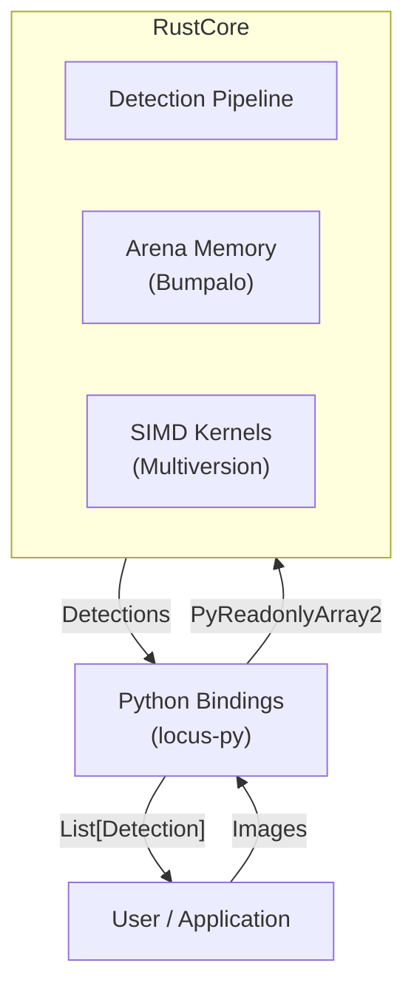
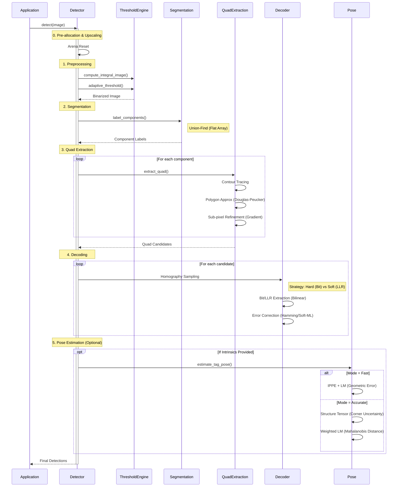
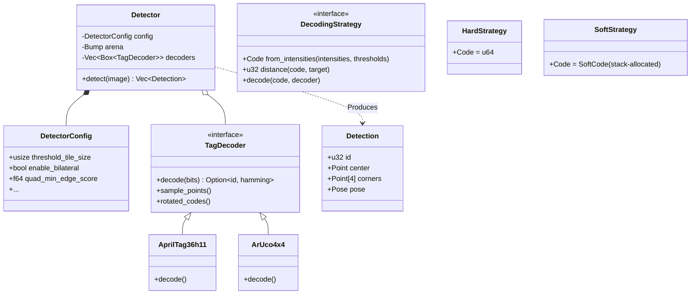
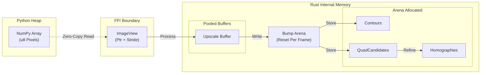
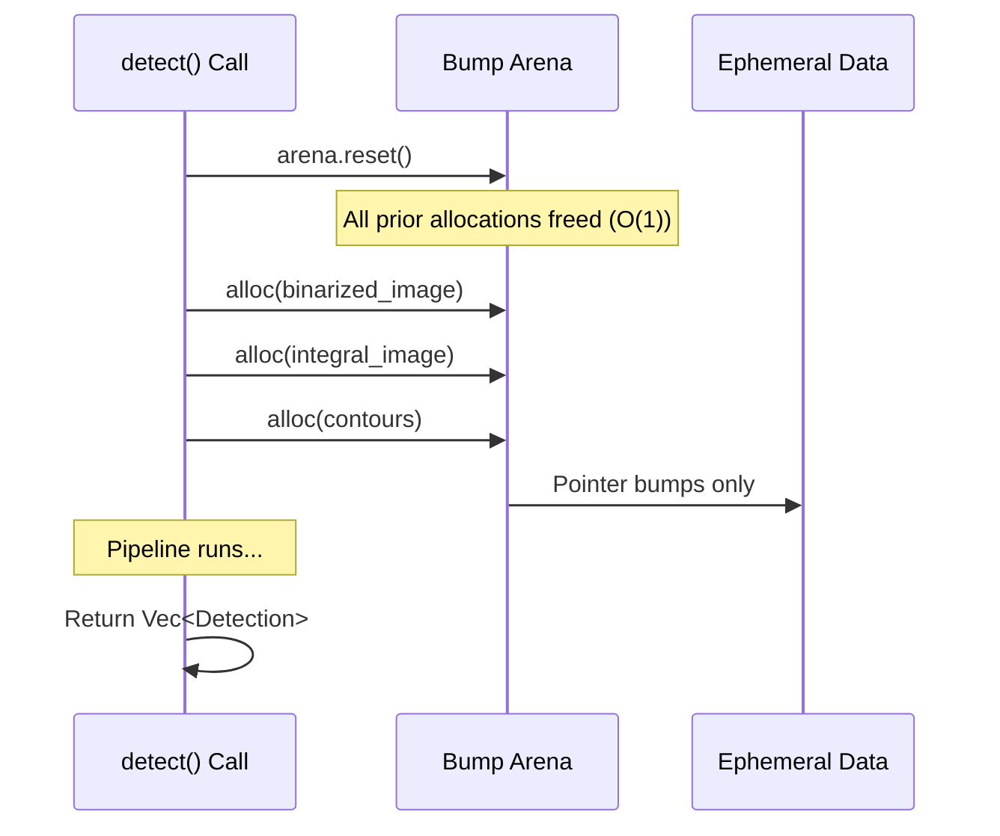
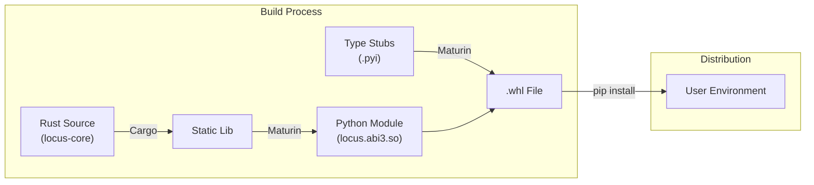

# System Architecture

This document provides a high-level overview of the Locus system architecture, designed for high-performance fiducial marker detection.

## High-Level Overview

Locus is built as a hybrid Rust/Python system. The core logic resides in a high-performance Rust crate (`locus-core`), which is exposed to Python via `pyo3` bindings (`locus-py`).



## Detection Pipeline

The detection pipeline follows a Data-Oriented Design (DOD) approach to minimize cache misses and allocation overhead. The entire hot path runs without heap allocations, using a pre-allocated arena that is reset per frame.



## Component Diagram

The system is structured around the `Detector` struct, which manages configuration and state.



## Design Principles

1.  **Zero-Copy Integration**: Utilizes the Python Buffer Protocol to access NumPy arrays directly, avoiding pixel data duplication.
2.  **Arena Memory**: Per-frame scratchpad (`bumpalo`) eliminates `malloc`/`free` overhead in the hot path.
3.  **Cache Locality**: Algorithms (thresholding, CCL) process data in linear, cache-friendly passes.
4.  **Runtime SIMD Dispatch**: Uses `multiversion` to target AVX2, AVX-512, or NEON based on host CPU capabilities.
5.  **Hybrid Parallelism**: Scales via `rayon` for data-parallel tasks while maintaining sequential cache-coherence for state-heavy stages.

## Memory Architecture

Locus minimizes latency through explicit memory management, almost entirely avoiding the system allocator during detection.



### Arena Lifecycle

The `Bump` arena is reset at the start of `detect()`, freeing all ephemeral data in $O(1)$ time.



## Observability & Debugging

Locus includes built-in instrumentation for performance profiling and visual debugging.

1.  **Tracing**: Uses the `tracing` crate to emit spans for every pipeline stage, allowing integration with `tracy` or `perfetto`.
2.  **Visual Debugging (Rerun)**: When enabled, Locus logs intermediate processing artifacts (threshold images, candidate quads, geometric fits) to the Rerun SDK for real-time inspection.

## Performance Characteristics

Targets a **low latency** budget for 1080p frames on modern CPUs.

| Stage | Complexity | Latency | Notes |
| :--- | :--- | :--- | :--- |
| **Preprocessing** | $O(N)$ | ~7.5 ms | Bandwidth-bound; SIMD-accelerated. |
| **Segmentation** | $O(N)$ | ~2.7 ms | Single-pass Union-Find. |
| **Quad Extraction** | $O(K \cdot M)$ | ~1.5 ms | $K$ components, $M$ perimeter pixels. |
| **Decoding (Hard)** | $O(Q)$ | ~0.5 ms | $Q$ candidates, bit-LUT based. |
| **Decoding (Soft)** | $O(Q \cdot D)$ | ~50 ms | $D$ dictionary entries, LLR search. |

*Note: Latencies are approximate for a single core on a modern CPU (e.g., Zen 4).*

## Decoding Strategies

The `DecodingStrategy` trait enables static dispatch between throughput-optimized and recall-optimized paths.

| Mode | Mechanism | Strength | Cost |
| :--- | :--- | :--- | :--- |
| **Hard-Decision** | Direct intensity thresholding. | Highest throughput; $O(1)$ lookup. | Requires stable SNR/contrast. |
| **Soft-Decision** | ML search using LLRs. | Recovers tags with blur or noise. | Latency scales with dictionary size. |

### Hard-Decision (High Throughput)
The default mode. It samples pixel intensities at grid points and compares them against the local adaptive threshold. This path is extremely fast and ideal for industrial applications with consistent lighting.

### Soft-Decision (Maximum Recall)
Designed for challenging conditions. Instead of binarizing, it computes the **Log-Likelihood Ratio (LLR)** for each bit and performs a Maximum Likelihood search across the dictionary. The implementation is zero-allocation and uses early-exit pruning to minimize search overhead.

## Pose Estimation Strategies

Locus provides two algorithms for 6-DOF recovery, allowing users to prioritize either geometric speed or probabilistic precision.

### Fast Mode: IPPE
*   **Target**: High-speed tracking and mobile robotics.
*   **Method**: Uses the **Infinitesimal Plane-Based Pose Estimation** algorithm for an analytic solution.
*   **Refinement**: Levenberg-Marquardt (LM) on geometric reprojection error.
*   **Latency**: ~50µs per tag.

### Accurate Mode: Probabilistic
*   **Target**: Metrology, calibration, and long-range precision landing.
*   **Method**: Estimates sub-pixel corner uncertainty via the **Structure Tensor** ($J^T J$).
*   **Refinement**: **Anisotropic Weighted LM** minimizing the Mahalanobis distance.
*   **Output**: Provides a full $6 \times 6$ `pose_covariance` matrix.
*   **Latency**: ~200µs per tag.

## Extensibility

Locus is designed to support new fiducial marker systems without modifying the core pipeline.

### Adding a New Tag Family

The `TagDecoder` trait serves as the extension point. To add a new family (e.g., `STag` or a custom ArUco dictionary):

1.  **Implement `TagDecoder`**: Define the grid dimension and bit extraction logic.
2.  **Define `TagDictionary`**: Provide the hamming distance lookup table.
3.  **Register**: Pass the new decoder to `Detector::add_decoder`.

```rust
struct MyCustomDecoder;

impl TagDecoder for MyCustomDecoder {
    fn name(&self) -> &str { "CustomTags" }
    fn dimension(&self) -> usize { 4 } // 4x4 grid
    
    // ... implementation ...
}

// Usage
let mut detector = Detector::new();
detector.add_decoder(Box::new(MyCustomDecoder));
```

## Packaging & Distribution

Locus uses `maturin` to bridge the Rust and Python worlds, creating a native Python extension module.



## Source Code Organization

The `locus-core` crate is organized into logical modules mirroring the pipeline stages.

| Module | Description | Key Structs |
| :--- | :--- | :--- |
| `image` | Zero-copy image views and pixel access. | `ImageView` |
| `threshold` | Adaptive thresholding and integral images. | `ThresholdEngine` |
| `segmentation` | Connected components labeling. | `UnionFind` |
| `quad` | Contour tracing and quad fitting. | `extract_quads` |
| `decoder` | Bit extraction and hamming decoding. | `TagDecoder`, `Homography` |
| `pose` | 3D pose estimation (PnP). | `Pose`, `CameraIntrinsics` |
| `pose_weighted` | Structure Tensor & Weighted LM. | `refine_pose_lm_weighted` |
| `gradient` | Image gradients & Sub-pixel windows. | `compute_structure_tensor` |
| `filter` | Pre-processing filters (Bilateral, Sharpen). | `bilateral_filter` |

