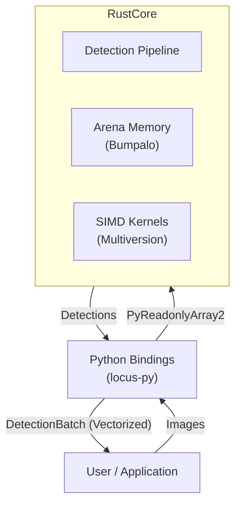
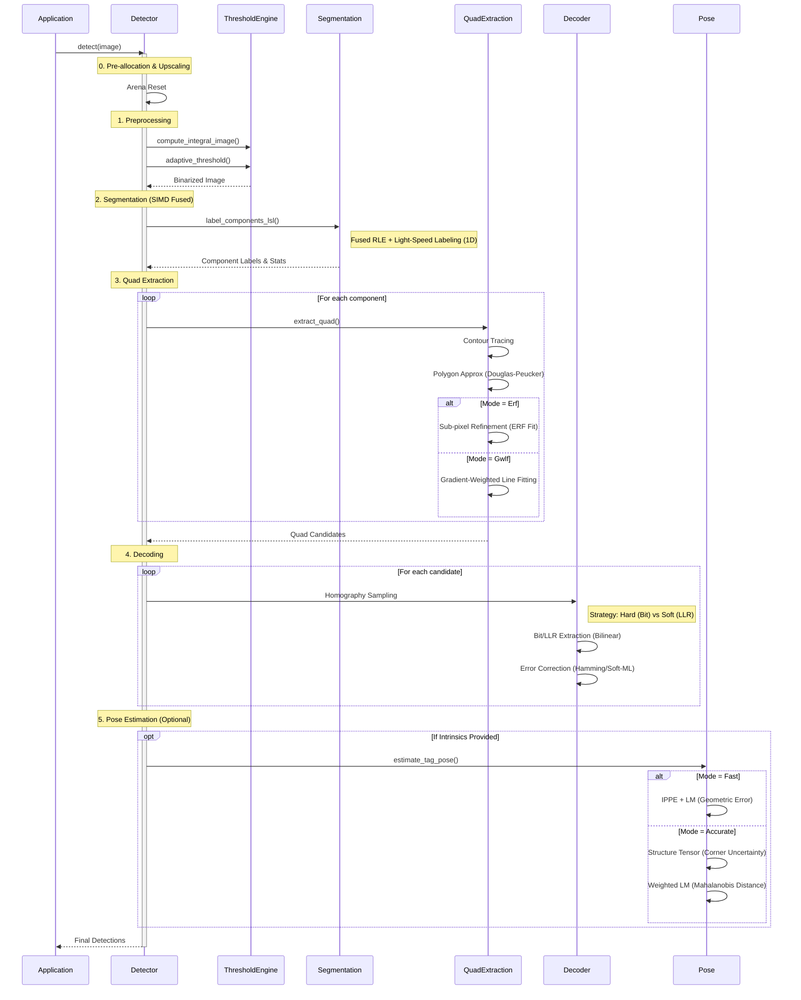
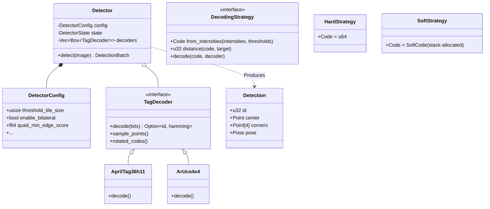
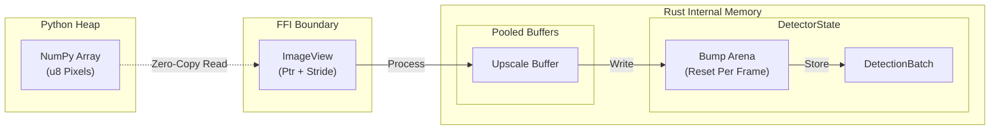
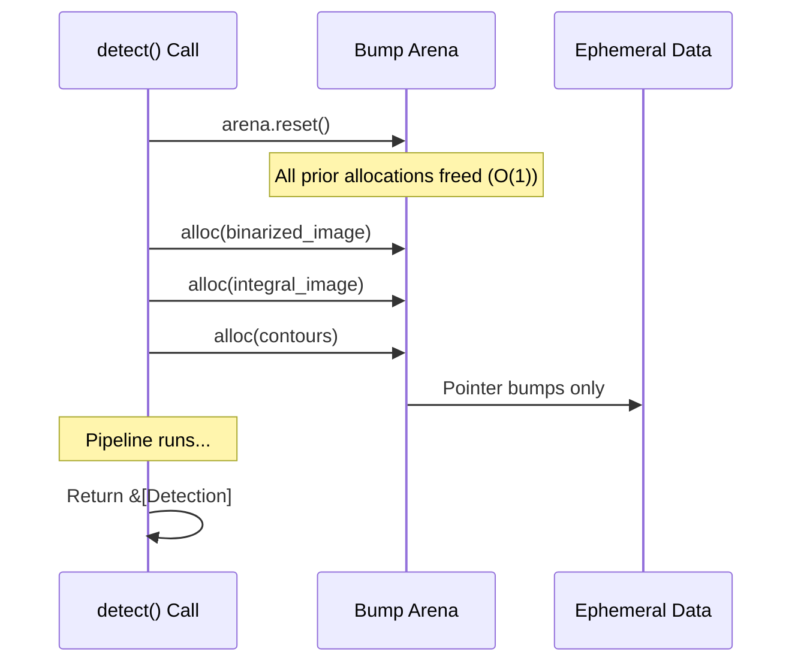
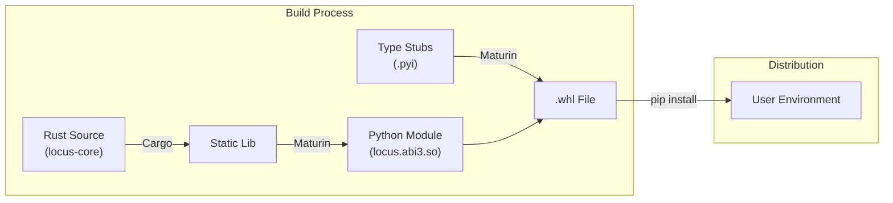

# System Architecture

This document provides a high-level overview of the Locus system architecture, designed for high-performance fiducial marker detection.

## High-Level Overview

Locus is built as a hybrid Rust/Python system. The core logic resides in a high-performance Rust crate (`locus-core`), which is exposed to Python via `pyo3` bindings (`locus-py`). All operations are conducted through the `Detector` class, which manages persistent state and enforces strict zero-copy, GIL-free execution.



## Detection Pipeline

The detection pipeline follows a Data-Oriented Design (DOD) approach to minimize cache misses and allocation overhead. The entire hot path runs without heap allocations, using a pre-allocated arena that is reset per frame.



## Component Diagram

The system is structured around the `Detector` struct, which manages configuration and state.



## Design Principles

1.  **Encapsulated Facade**: The `Detector` struct provides a single, robust entry point that owns all complex memory lifetimes (arenas, SoA batches), removing the cognitive burden of resource management from the user.
2.  **Zero-Copy Integration**: Utilizes the Python Buffer Protocol to access NumPy arrays directly. Python results are returned as a vectorized `DetectionBatch` dataclass containing zero-copy NumPy views of the internal SoA layout, maximizing throughput for downstream consumers.
3.  **Thread Concurrency (GIL-Free)**: Releases the Python Global Interpreter Lock (GIL) during the heavy perception pipeline, allowing true multi-threaded execution and preventing blocking in concurrent Python applications.
4.  **Arena Memory**: Internal per-frame scratchpad (`bumpalo`) eliminates `malloc`/`free` overhead in the hot path.
5.  **Cache Locality**: Algorithms (thresholding, CCL) process data in linear, cache-friendly passes.
6.  **Runtime SIMD Dispatch**: Uses `multiversion` to target AVX2, AVX-512, or NEON based on host CPU capabilities.
7.  **Structure of Arrays (SoA) Layout**: Built around the `DetectionBatch`, which eliminates L1 cache misses during math-heavy passes and ensures SIMD-alignment for all mathematical operations.
8.  **Semantic Configuration**: Employs a `DetectorBuilder` to provide a human-friendly API for pipeline tuning, abstracting 20+ fine-grained parameters into high-level semantic methods.
9.  **Fast-Path Funnel**: Implements a multi-stage rejection gate and sampling routine. It uses an O(1) contrast gate to reject background artifacts early, followed by SIMD-accelerated coordinate generation via Digital Differential Analyzer (DDA) and vectorized bilinear interpolation.
10. **Fast-Math Sampling**: Rewrites homography projection and bilinear interpolation using hardware reciprocal approximation (`rcp_nr_v8`) and vectorized FMA instructions to minimize latency.
11. **Hybrid ROI Caching**: Minimizes L1 cache misses by copying tag candidates into contiguous stack (small tags) or arena (large tags) buffers before sampling.
12. **Hybrid Parallelism**: Scales via `rayon` for data-parallel tasks while maintaining sequential cache-coherence for state-heavy stages.

## Memory Architecture

Locus minimizes latency through explicit memory management, almost entirely avoiding the system allocator during detection. The system follows the [DetectionBatch (SoA) Contract](../engineering/detection-batch-contract.md) to ensure zero-allocation performance and cache efficiency.



### Arena Lifecycle

The `Bump` arena is reset at the start of `detect()`, freeing all ephemeral data in $O(1)$ time.



## Observability & Debugging

Locus includes built-in instrumentation for performance profiling and visual debugging, designed for high-resolution visibility without runtime overhead.

1.  **Zero-Cost Tracing**: Uses the `tracing` crate to emit static spans for the 6 major pipeline stages. Production builds utilize **compile-time erasure** (`release_max_level_info`) to ensure zero runtime cost when deployed.
2.  **Mutually Exclusive Telemetry Matrix**: To eliminate the "Observer Effect" during profiling, the regression suite implements a decoupled telemetry architecture via the `TELEMETRY_MODE` environment variable. This ensures that heavy JSON serialization does not pollute high-fidelity Tracy timings.
    - `TELEMETRY_MODE=tracy`: Enables the high-fidelity `TracyLayer` for deep GUI-based pipeline analysis.
    - `TELEMETRY_MODE=json`: Enables a non-blocking JSON subscriber, dumping structured pipeline timings to `target/profiling/{test_id}_events.json` for AI analysis.
    - `Unset`: Telemetry remains silent for maximum general test performance.
3.  **Visual Debugging (Rerun)**: When enabled, Locus logs intermediate processing artifacts to the Rerun SDK for real-time inspection. This system is designed for **zero production overhead**:
    - **Zero-Copy Views**: Rejected quads and Hamming distances are exposed via zero-copy slices from the existing SoA batch.
    - **Arena-Allocated Telemetry**: Complex diagnostics (subpixel jitter vectors, reprojection RMSE) are computed on-demand and allocated in the frame-local `arena` scratching pool.
    - **Remote/Edge Ready**: Supports remote connectivity via `--rerun-addr` (using `rerun+http://` schemes) and local web serving, allowing seamless debugging of edge devices from a local host.
4.  **Developer CLI**: Provides a unified `tools/cli.py` (executed via `uv run`) for benchmarking, visualization, and dictionary validation.

## Performance Characteristics

Targets a **low latency** budget for high-resolution frames on modern CPUs.

| Stage | Complexity | Latency (50 Tags, 720p) | Notes |
| :--- | :--- | :--- | :--- |
| **Preprocessing** | $O(N)$ | ~0.9 ms | Adaptive thresholding + Integral Image. |
| **Segmentation** | $O(N)$ | ~0.5 ms | SIMD Fused RLE + Light-Speed Labeling (LSL). |
| **Quad Extraction** | $O(K \cdot M)$ | ~1.5 ms | Massive gain from SoA extraction. |
| **Decoding (Hard)** | $O(Q)$ | ~10.0 ms | SoA math pass; SIMD bilinear sampling. |
| **Pose Refinement** | $O(V) | ~0.2 ms | Partitioned solver (Valid tags only). |

*Note: Total latency ~14.5ms for 50 tags (720p) on a modern desktop CPU (e.g., Zen 4).*

## Sub-pixel Refinement Strategies

Locus provides two distinct algorithms for sub-pixel corner localization, selectable via `CornerRefinementMode`.

| Mode | Algorithm | Strength | Target Use Case |
| :--- | :--- | :--- | :--- |
| **ERF** | Edge Response Function | Localized accuracy on high-contrast edges. | Front-parallel tags, stable lighting. |
| **GWLF** | Gradient-Weighted Line Fitting | Robustness to blur and grazing angles. | Robotics, high-speed motion, steep angles. |

### Edge Response Function (ERF)
Fits a 1D Gaussian to the gradient profile along the normal of each edge. It is highly effective for front-parallel tags but can be sensitive to corner rounding caused by lens blur.

### Gradient-Weighted Line Fitting (GWLF)
A robust geometric approach that fits infinite lines to the image gradients along each of the four edges using **Weighted Orthogonal Distance Regression (PCA)**. The refined corner is computed as the algebraic intersection of these lines in homogeneous space. GWLF is significantly more robust to optical low-pass filtering and grazing angles, often providing a **~10x improvement in rotation stability** at high resolutions. The implementation uses **bilinear gradient sampling** and **Adaptive Transversal Windowing**, where the search band scales proportionally with the edge length ($\pm \max(2, 0.01L)$).

## Decoding Strategies

The `DecodingStrategy` trait enables static dispatch between throughput-optimized and recall-optimized paths.

| Mode | Mechanism | Strength | Cost |
| :--- | :--- | :--- | :--- |
| **Hard-Decision** | Direct intensity thresholding. | Highest throughput; $O(1)$ lookup. | Requires stable SNR/contrast. |
| **Soft-Decision** | MIH-indexed ML search using LLRs. | Recovers tags with blur or noise. | Sub-linear search via Multi-Index Hashing. |

### Hard-Decision (High Throughput)
The default mode. It samples pixel intensities at grid points and compares them against the local adaptive threshold. This path is extremely fast and ideal for industrial applications with consistent lighting.

### Soft-Decision (Maximum Recall)
Designed for challenging conditions. Instead of binarizing, it computes the **Log-Likelihood Ratio (LLR)** for each bit and performs a Maximum Likelihood search across the dictionary. For efficiency, it utilizes **Multi-Index Hashing (MIH)** to achieve sub-linear search performance, making it viable for real-time applications even with large tag families (e.g., 41h12). The implementation is zero-allocation and uses early-exit pruning to minimize search overhead.

## Pose Estimation Strategies

Locus provides two algorithms for 6-DOF recovery, allowing users to prioritize either geometric speed or probabilistic precision.

### Fast Mode: IPPE
*   **Target**: High-speed tracking and mobile robotics.
*   **Method**: Uses the **Infinitesimal Plane-Based Pose Estimation** algorithm for an analytic solution.
*   **Refinement**: Levenberg-Marquardt (LM) on geometric reprojection error.
*   **Latency**: ~50µs per tag.

### Accurate Mode: Probabilistic
*   **Target**: Metrology, calibration, and long-range precision landing.
*   **Method**: Estimates sub-pixel corner uncertainty via either the **Structure Tensor** ($J^T J$) or formal error propagation through **Gradient-Weighted Line Fitting (GWLF)**.
*   **Refinement**: **Anisotropic Weighted LM** minimizing the Mahalanobis distance.
*   **Output**: Provides a full $6 \times 6$ `pose_covariance` matrix.
*   **Latency**: ~200µs per tag.

## Extensibility

Locus is designed to support new fiducial marker systems without modifying the core pipeline.

### Adding a New Tag Family

The `TagDecoder` trait serves as the extension point. To add a new family (e.g., `STag` or a custom ArUco dictionary):

1.  **Implement `TagDecoder`**: Define the grid dimension and bit extraction logic.
2.  **Define `TagDictionary`**: Provide the hamming distance lookup table.
3.  **Register**: Pass the new decoder to the detector (typically via `DetectorBuilder`).

```rust
struct MyCustomDecoder;

impl TagDecoder for MyCustomDecoder {
    fn name(&self) -> &str { "CustomTags" }
    fn dimension(&self) -> usize { 4 } // 4x4 grid

    // ... implementation ...
}

// Usage
let mut detector = DetectorBuilder::new()
    .with_family(TagFamily::AprilTag36h11)
    .build();
```

## Packaging & Distribution

Locus uses `maturin` to bridge the Rust and Python worlds, creating a native Python extension module.



## Source Code Organization

The `locus-core` crate is organized into logical modules mirroring the pipeline stages.

| Module | Description | Key Structs |
| :--- | :--- | :--- |
| `image` | Zero-copy image views and pixel access. | `ImageView` |
| `threshold` | Adaptive thresholding and integral images. | `ThresholdEngine` |
| `segmentation` | Connected components labeling. | `UnionFind` |
| `simd_ccl_fusion` | SIMD Fused RLE & LSL. | `extract_rle_segments` |
| `quad` | Contour tracing and quad fitting. | `extract_quads` |
| `gwlf` | Gradient-Weighted Line Fitting. | `refine_quad_gwlf` |
| `decoder` | Bit extraction and hamming decoding. | `TagDecoder`, `Homography` |
| `funnel` | Fast-path rejection gate (O(1) contrast). | `apply_funnel_gate` |
| `pose` | 3D pose estimation (PnP). | `Pose`, `CameraIntrinsics` |
| `pose_weighted` | Structure Tensor & Weighted LM. | `refine_pose_lm_weighted` |
| `gradient` | Image gradients & Sub-pixel windows. | `compute_structure_tensor` |
| `filter` | Pre-processing filters (Bilateral, Sharpen). | `bilateral_filter` |
