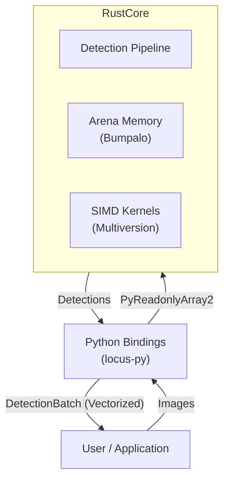
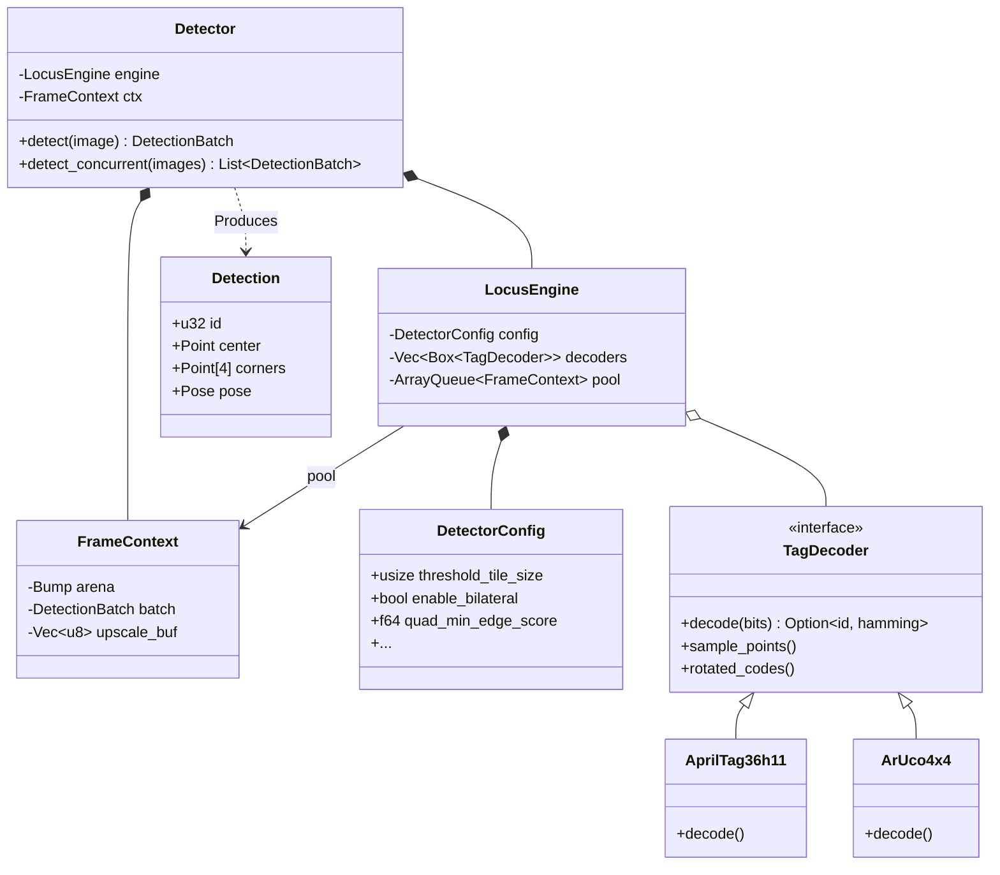
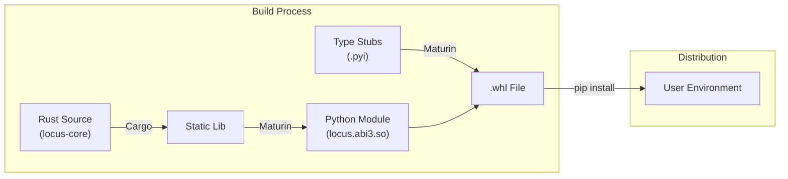

# System Architecture

This document provides a high-level overview of the Locus system architecture, designed for high-performance fiducial marker detection. For deeper dives, see:

- [Detection Pipeline](pipeline.md) — chronological data flow and stage-by-stage execution
- [Memory Model](memory_model.md) — SoA layout, arena lifecycle, and zero-copy FFI
- [Algorithms](algorithms.md) — mathematical foundations of each solver

## High-Level Overview

Locus is built as a hybrid Rust/Python system. The core logic resides in a high-performance Rust crate (`locus-core`), which is exposed to Python via `pyo3` bindings (`locus-py`). All operations go through a single `Detector` class: single-frame via `detect()`, or concurrent batch via `detect_concurrent()` when constructed with `max_concurrent_frames > 1`.



## Component Diagram

The system is structured around a single `Detector` class that wraps an immutable `LocusEngine` (config + decoders + pool) and a dedicated `FrameContext` for single-frame use. `LocusEngine` and `FrameContext` are internal implementation details; the Python API exposes only `Detector`.



## Design Principles

1.  **Encapsulated Facade**: The `Detector` struct provides a single, robust entry point for single-threaded use that owns all complex memory lifetimes (arenas, SoA batches), removing the cognitive burden of resource management from the user.
2.  **Zero-Copy Integration**: Utilizes the Python Buffer Protocol to access NumPy arrays directly. Python results are returned as a vectorized `DetectionBatch` dataclass containing zero-copy NumPy views of the internal SoA layout, maximizing throughput for downstream consumers.
3.  **Thread Concurrency (GIL-Free)**: `Detector` exposes two orthogonal concurrency axes: `threads` controls intra-frame Rayon parallelism; `max_concurrent_frames` sizes an internal lock-free `crossbeam::ArrayQueue` pool of `FrameContext` objects for inter-frame parallelism via `detect_concurrent`. The GIL is released for the entire compute section of both `detect` and `detect_concurrent`.
4.  **Arena Memory**: Internal per-frame scratchpad (`bumpalo`) eliminates `malloc`/`free` overhead in the hot path. See [Memory Model](memory_model.md) for details.
5.  **Cache Locality**: Algorithms (thresholding, CCL) process data in linear, cache-friendly passes.
6.  **Runtime SIMD Dispatch**: Uses `multiversion` to target AVX2, AVX-512, or NEON based on host CPU capabilities.
7.  **Structure of Arrays (SoA) Layout**: Built around the `DetectionBatch`, which eliminates L1 cache misses during math-heavy passes and ensures SIMD-alignment for all mathematical operations.
8.  **Semantic Configuration**: Employs a `DetectorBuilder` to provide a human-friendly API for pipeline tuning, abstracting 20+ fine-grained parameters into high-level semantic methods.
9.  **Fast-Path Funnel**: Implements a multi-stage rejection gate and sampling routine. It uses an O(1) contrast gate to reject background artifacts early, followed by SIMD-accelerated coordinate generation via Digital Differential Analyzer (DDA) and vectorized bilinear interpolation.
10. **Fast-Math Sampling**: Rewrites homography projection and bilinear interpolation using hardware reciprocal approximation (`rcp_nr_v8`) and vectorized FMA instructions to minimize latency.
11. **Hybrid ROI Caching**: Minimizes L1 cache misses by copying tag candidates into contiguous stack (small tags) or arena (large tags) buffers before sampling.
12. **Hybrid Parallelism**: Scales via `rayon` for data-parallel tasks while maintaining sequential cache-coherence for state-heavy stages.
13. **Typed Board Topology**: Board geometry is expressed as typed, immutable structs (`AprilGridTopology`, `CharucoTopology`) wrapped in `Arc` for zero-clone sharing across frames and threads. Constructor validation fails fast if the marker count exceeds the target dictionary size.

## Observability & Debugging

Locus includes built-in instrumentation for performance profiling and visual debugging, designed for high-resolution visibility without runtime overhead.

1.  **Zero-Cost Tracing**: Uses the `tracing` crate to emit static spans for the 6 major pipeline stages. Production builds utilize **compile-time erasure** (`release_max_level_info`) to ensure zero runtime cost when deployed.
2.  **Mutually Exclusive Telemetry Matrix**: To eliminate the "Observer Effect" during profiling, the regression suite implements a decoupled telemetry architecture via the `TELEMETRY_MODE` environment variable. This ensures that heavy JSON serialization does not pollute high-fidelity Tracy timings.
    - `TELEMETRY_MODE=tracy`: Enables the high-fidelity `TracyLayer` for deep GUI-based pipeline analysis.
    - `TELEMETRY_MODE=json`: Enables a non-blocking JSON subscriber, dumping structured pipeline timings to `target/profiling/{test_id}_events.json` for AI analysis.
    - `Unset`: Telemetry remains silent for maximum general test performance.
3.  **Visual Debugging (Rerun)**: When enabled, Locus logs intermediate processing artifacts to the Rerun SDK for real-time inspection. This system is designed for **zero production overhead**:
    - **Zero-Copy Views**: Rejected quads and Hamming distances are exposed via zero-copy slices from the existing SoA batch.
    - **Arena-Allocated Telemetry**: Complex diagnostics (subpixel jitter vectors, reprojection RMSE) are computed on-demand and allocated in the frame-local `arena` scratching pool.
    - **Remote/Edge Ready**: Supports remote connectivity via `--rerun-addr` (using `rerun+http://` schemes) and local web serving, allowing seamless debugging of edge devices from a local host.
4.  **Developer CLI**: Provides a unified `tools/cli.py` (executed via `uv run`) for benchmarking, visualization, and dictionary validation.

## Performance Characteristics

Targets a **low latency** budget for high-resolution frames on modern CPUs.

| Stage | Complexity | Latency (50 Tags, 720p) | Notes |
| :--- | :--- | :--- | :--- |
| **Preprocessing** | $O(N)$ | ~0.9 ms | Adaptive thresholding + Integral Image. |
| **Segmentation** | $O(N)$ | ~0.5 ms | SIMD Fused RLE + Light-Speed Labeling (LSL). |
| **Quad Extraction** | $O(K \cdot M)$ | ~1.5 ms | Massive gain from SoA extraction. |
| **Decoding (Hard)** | $O(Q)$ | ~10.0 ms | SoA math pass; SIMD bilinear sampling. |
| **Pose Refinement** | $O(V)$ | ~0.2 ms | Partitioned solver (Valid tags only). |

*Note: Total latency ~14.5ms for 50 tags (720p) on a modern desktop CPU (e.g., Zen 4).*

## Extensibility

Locus is designed to support new fiducial marker systems without modifying the core pipeline.

### Adding a New Tag Family

The `TagDecoder` trait serves as the extension point. To add a new family (e.g., `STag` or a custom ArUco dictionary):

1.  **Implement `TagDecoder`**: Define the grid dimension and bit extraction logic.
2.  **Define `TagDictionary`**: Provide the hamming distance lookup table.
3.  **Register**: Pass the new decoder to the detector (typically via `DetectorBuilder`).

```rust
struct MyCustomDecoder;

impl TagDecoder for MyCustomDecoder {
    fn name(&self) -> &str { "CustomTags" }
    fn dimension(&self) -> usize { 4 } // 4x4 grid

    // ... implementation ...
}

// Usage
let mut detector = DetectorBuilder::new()
    .with_family(TagFamily::AprilTag36h11)
    .build();
```

## Packaging & Distribution

Locus uses `maturin` to bridge the Rust and Python worlds, creating a native Python extension module.



## Source Code Organization

The `locus-core` crate is organized into logical modules mirroring the pipeline stages.

| Module | Description | Key Structs |
| :--- | :--- | :--- |
| `image` | Zero-copy image views and pixel access. | `ImageView` |
| `threshold` | Adaptive thresholding and integral images. | `ThresholdEngine` |
| `segmentation` | Connected components labeling. | `UnionFind` |
| `simd_ccl_fusion` | SIMD Fused RLE & LSL. | `extract_rle_segments` |
| `quad` | Contour tracing and quad fitting. | `extract_quads` |
| `gwlf` | Gradient-Weighted Line Fitting. | `refine_quad_gwlf` |
| `homography` | Projective geometry primitives (DLT, DDA). | `Homography`, `HomographyDda` |
| `decoder` | Bit extraction and hamming decoding. | `TagDecoder` |
| `funnel` | Fast-path rejection gate (O(1) contrast). | `apply_funnel_gate` |
| `pose` | 3D pose estimation (PnP). | `Pose`, `CameraIntrinsics` |
| `pose_weighted` | Structure Tensor & Weighted LM. | `refine_pose_lm_weighted` |
| `gradient` | Image gradients & Sub-pixel windows. | `compute_structure_tensor` |
| `filter` | Pre-processing filters (Bilateral, Sharpen). | `bilateral_filter` |
| `edge_refinement` | Unified ERF sub-pixel refinement. | `ErfEdgeFitter` |
| `simd::math` | Centralized math kernels (erf, rcp). | `erf_approx`, `erf_approx_v4` |
| `board` | Board topology types and multi-tag pose estimation. | `AprilGridTopology`, `CharucoTopology`, `BoardEstimator` |
| `charuco` | ChAruco saddle-point extraction and board pose. | `CharucoRefiner`, `CharucoResult` |
