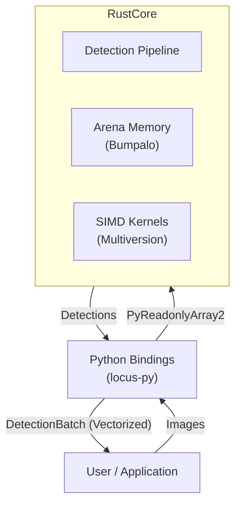
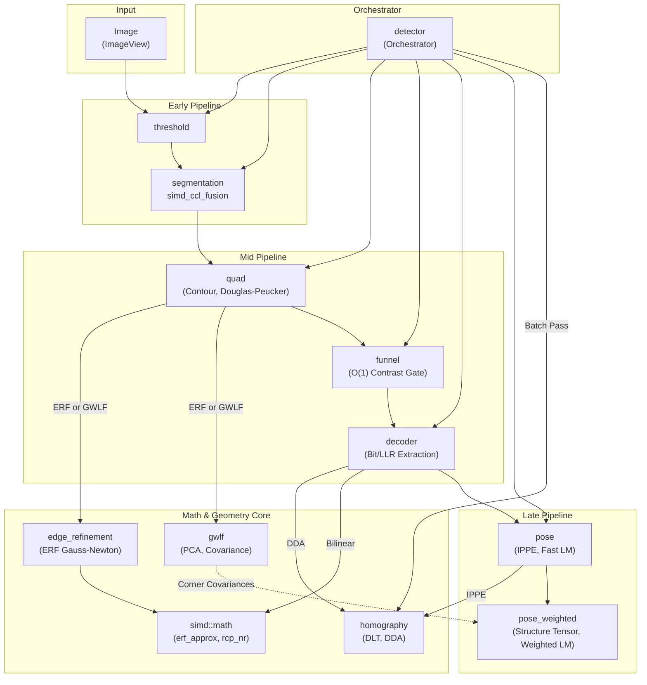
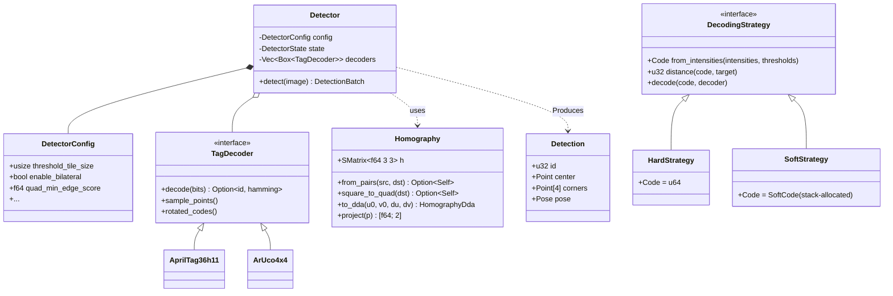
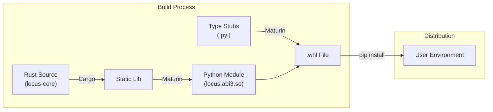

# System Architecture

This document provides a high-level overview of the Locus system architecture. For detailed treatment of each concern, see:

- **[Pipeline](pipeline.md)** — Chronological data flow through all detection stages.
- **[Memory Model](memory_model.md)** — SoA layout, arena allocation, and zero-copy FFI.
- **[Algorithms](algorithms.md)** — Mathematical foundations of each solver.

## High-Level Overview

Locus is a hybrid Rust/Python system. The core logic resides in a high-performance Rust crate (`locus-core`), exposed to Python via `pyo3` bindings (`locus-py`). All operations flow through the `Detector` class, which manages persistent state and enforces strict zero-copy, GIL-free execution.

## Module Dependency Map

The pipeline stages share a centralized Math & Geometry Core that provides fundamental primitives (homography, ERF, GWLF, IPPE, LM solvers). This eliminates code duplication and ensures mathematical consistency across the system.

## Component Diagram

## Design Principles

1.  **Encapsulated Facade**: The `Detector` struct provides a single entry point that owns all complex memory lifetimes (arenas, SoA batches).
2.  **Zero-Copy Integration**: Utilizes the Python Buffer Protocol for input; returns vectorized `DetectionBatch` with zero-copy NumPy views.
3.  **Thread Concurrency (GIL-Free)**: Releases the GIL during the perception pipeline for true multi-threaded execution.
4.  **Arena Memory**: Per-frame scratchpad (`bumpalo`) eliminates `malloc`/`free` overhead. See [Memory Model](memory_model.md).
5.  **Cache Locality**: Linear, cache-friendly passes. SoA layout eliminates L1 misses during math-heavy stages.
6.  **Runtime SIMD Dispatch**: `multiversion` targets AVX2, AVX-512, or NEON based on host CPU.
7.  **Centralized Math Core**: Shared geometry primitives (`homography`, `edge_refinement`, `gwlf`, `simd::math`) serve multiple pipeline stages, enforcing DRY and mathematical consistency.
8.  **Semantic Configuration**: `DetectorBuilder` abstracts 20+ parameters into high-level semantic methods.
9.  **Fast-Path Funnel**: $O(1)$ contrast gate rejects background artifacts before expensive decoding.
10. **Hybrid Parallelism**: `rayon` for data-parallel tasks; sequential execution for state-heavy stages.

## Sub-pixel Refinement Strategies

| Mode | Algorithm | Strength | Target Use Case |
| :--- | :--- | :--- | :--- |
| **ERF** | Edge Response Function | Localized accuracy on high-contrast edges. | Front-parallel tags, stable lighting. |
| **GWLF** | Gradient-Weighted Line Fitting | Robustness to blur and grazing angles. Propagates corner covariances. | Robotics, high-speed motion, steep angles. |

See [Algorithms: ERF](algorithms.md#2-erf-sub-pixel-edge-refinement) and [Algorithms: GWLF](algorithms.md#3-gradient-weighted-line-fitting-gwlf) for mathematical details.

## Decoding Strategies

| Mode | Mechanism | Strength | Cost |
| :--- | :--- | :--- | :--- |
| **Hard-Decision** | Direct intensity thresholding. | Highest throughput; $O(1)$ lookup. | Requires stable SNR/contrast. |
| **Soft-Decision** | MIH-indexed ML search using LLRs. | Recovers tags with blur or noise. | Sub-linear search via Multi-Index Hashing. |

See [Algorithms: Decoding](algorithms.md#6-decoding-strategies) for details.

## Pose Estimation Strategies

| Mode | Method | Uncertainty Output | Latency |
| :--- | :--- | :--- | :--- |
| **Fast** | IPPE + Huber-robust LM (geometric error) | None | ~50 us/tag |
| **Accurate** | IPPE + Huber-robust Weighted LM (Mahalanobis) | $6 \times 6$ pose covariance | ~200 us/tag |

See [Algorithms: IPPE](algorithms.md#4-ippe-square-pose-estimation) and [Algorithms: LM](algorithms.md#5-levenberg-marquardt-pose-refinement) for mathematical details.

## Observability & Debugging

1.  **Zero-Cost Tracing**: `tracing` crate with compile-time erasure (`release_max_level_info`) for zero runtime cost in production.
2.  **Mutually Exclusive Telemetry**: `TELEMETRY_MODE` environment variable selects between Tracy (`tracy`), JSON (`json`), or silent (unset) modes.
3.  **Visual Debugging (Rerun)**: Zero-overhead diagnostic pipeline with arena-allocated telemetry and remote connectivity support.
4.  **Developer CLI**: `tools/cli.py` (via `uv run`) for benchmarking, visualization, and dictionary validation.

## Extensibility

The `TagDecoder` trait is the extension point for new tag families. See [How-To: Add a Dictionary](../how-to/add_dictionary.md).

## Packaging & Distribution

## Source Code Organization

| Module | Description | Key Structs |
| :--- | :--- | :--- |
| `image` | Zero-copy image views and pixel access. | `ImageView` |
| `threshold` | Adaptive thresholding and integral images. | `ThresholdEngine` |
| `segmentation` | Connected components labeling. | `UnionFind` |
| `simd_ccl_fusion` | SIMD Fused RLE & LSL. | `extract_rle_segments` |
| `quad` | Contour tracing and quad fitting. | `extract_quads` |
| `edge_refinement` | Unified ERF Gauss-Newton solver. | `refine_edge_erf` |
| `gwlf` | Gradient-Weighted Line Fitting. | `refine_quad_gwlf`, `HomogeneousLine` |
| `homography` | Projective geometry (DLT, DDA). | `Homography`, `HomographyDda` |
| `decoder` | Bit extraction and hamming decoding. | `TagDecoder` |
| `funnel` | Fast-path rejection gate ($O(1)$ contrast). | `apply_funnel_gate` |
| `pose` | IPPE + Fast LM pose estimation. | `Pose`, `CameraIntrinsics` |
| `pose_weighted` | Structure Tensor & Weighted LM. | `refine_pose_lm_weighted` |
| `gradient` | Image gradients & sub-pixel windows. | `compute_structure_tensor` |
| `filter` | Pre-processing filters (Bilateral, Sharpen). | `bilateral_filter` |
| `simd` | SIMD math kernels (`erf_approx`, `rcp_nr`). | — |
