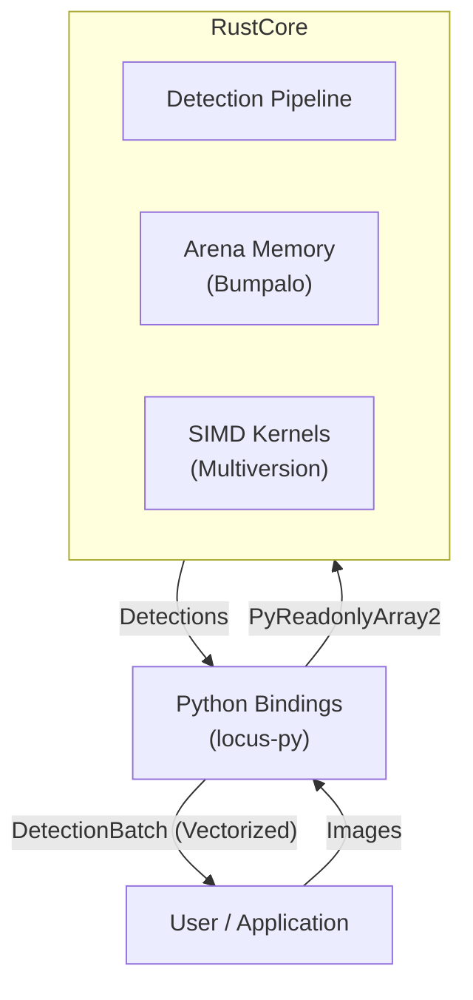
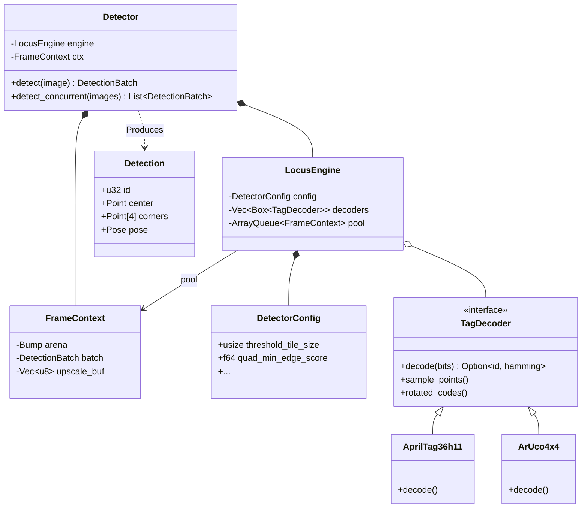
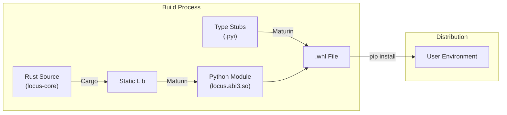

# System Architecture

This document provides a high-level overview of the Locus system architecture, designed for high-performance fiducial marker detection. For deeper dives, see:

- [Detection Pipeline](pipeline.md) — chronological data flow and stage-by-stage execution
- [Memory Model](memory_model.md) — SoA layout, arena lifecycle, and zero-copy FFI
- [Algorithms](algorithms.md) — mathematical foundations of each solver

## High-Level Overview

Locus is built as a hybrid Rust/Python system. The core logic resides in a high-performance Rust crate (`locus-core`), which is exposed to Python via `pyo3` bindings (`locus-py`). All operations go through a single `Detector` class: single-frame via `detect()`, or concurrent batch via `detect_concurrent()` when constructed with `max_concurrent_frames > 1`.


```mermaid
flowchart TD
    User[User / Application] -->|Images| PyBindings["Python Bindings<br/>(locus-py)"]
    PyBindings -->|PyReadonlyArray2| RustCore["Rust Core<br/>(locus-core)"]

    subgraph RustCore
        Pipeline["Detection Pipeline"]
        Memory["Arena Memory<br/>(Bumpalo)"]
        SIMD["SIMD Kernels<br/>(Multiversion)"]
    end

    RustCore -->|Detections| PyBindings
    PyBindings -->|"DetectionBatch (Vectorized)"| User
```

## Component Diagram

The system is structured around a single `Detector` class that wraps an immutable `LocusEngine` (config + decoders + pool) and a dedicated `FrameContext` for single-frame use. `LocusEngine` and `FrameContext` are internal implementation details; the Python API exposes only `Detector`.


```mermaid
classDiagram
    class Detector {
        -LocusEngine engine
        -FrameContext ctx
        +detect(image) DetectionBatch
        +detect_concurrent(images) List~DetectionBatch~
    }

    class LocusEngine {
        -DetectorConfig config
        -Vec~Box~TagDecoder~~ decoders
        -ArrayQueue~FrameContext~ pool
    }

    class FrameContext {
        -Bump arena
        -DetectionBatch batch
        -Vec~u8~ upscale_buf
    }

    class DetectorConfig {
        +usize threshold_tile_size
        +f64 quad_min_edge_score
        +...
    }

    class TagDecoder {
        <<interface>>
        +decode(bits) Option~id, hamming~
        +sample_points()
        +rotated_codes()
    }

    class AprilTag36h11 {
        +decode()
    }

    class ArUco4x4 {
        +decode()
    }

    class Detection {
        +u32 id
        +Point center
        +Point[4] corners
        +Pose pose
    }

    Detector *-- LocusEngine
    Detector *-- FrameContext
    LocusEngine *-- DetectorConfig
    LocusEngine o-- TagDecoder
    LocusEngine --> FrameContext : pool
    TagDecoder <|-- AprilTag36h11
    TagDecoder <|-- ArUco4x4
    Detector ..> Detection : Produces
```

## Design Principles

1.  **Direct Memory Access**: Locus uses the Python Buffer Protocol to read NumPy arrays directly, avoiding copies at the FFI boundary.
2.  **GIL-Free Pipeline**: The Python Global Interpreter Lock is released for the entire detection pass, enabling true multi-threaded perception in Python.
3.  **Arena Allocation**: A per-frame `bumpalo` arena handles all ephemeral scratch memory, resulting in zero `malloc`/`free` calls in the detection hot-path.
4.  **Structure of Arrays (SoA)**: Internal state is stored in parallel arrays (`DetectionBatch`) to maximize L1 cache hits and enable SIMD-aligned loads.
5.  **Runtime SIMD Dispatch**: Mathematical kernels (bilinear sampling, DDA, thresholding) are specialized for AVX2, AVX-512, or NEON at runtime.
6.  **Fast-Path Rejection**: Cheap gates — component and contour pre-rejects, the O(1) contrast funnel, the edge-contrast gate — drop most false candidates before bit sampling; the border-ring check and the codeword budget judge the rest.
7.  **Immutable Topology**: Board geometries (AprilGrid, ChAruco) are immutable structs shared across threads via `Arc`, with strict validation at construction.
8.  **Zero-Overhead Telemetry**: Performance tracing is compiled out in release builds unless explicitly requested via `debug_telemetry=True`.

## Observability & Debugging

Locus includes built-in instrumentation for performance profiling and visual debugging, designed for high-resolution visibility without runtime overhead.

1.  **Zero-Cost Tracing**: Uses the `tracing` crate to emit static spans for the 6 major pipeline stages. Production builds utilize **compile-time erasure** (`release_max_level_info`) to ensure zero runtime cost when deployed.
2.  **Mutually Exclusive Telemetry Matrix**: To eliminate the "Observer Effect" during profiling, the regression suite implements a decoupled telemetry architecture via the `TELEMETRY_MODE` environment variable. This ensures that heavy JSON serialization does not pollute high-fidelity Tracy timings.
    - `TELEMETRY_MODE=tracy`: Enables the high-fidelity `TracyLayer` for deep GUI-based pipeline analysis.
    - `TELEMETRY_MODE=json`: Enables a non-blocking JSON subscriber, dumping structured pipeline timings to `target/profiling/{test_id}_events.json` for AI analysis.
    - `Unset`: Telemetry remains silent for maximum general test performance.
3.  **Visual Debugging (Rerun)**: When enabled, Locus logs intermediate processing artifacts to the Rerun SDK for real-time inspection. This system is designed for **zero production overhead**:
    - **Zero-Copy Views**: Rejected quads and Hamming distances are exposed via zero-copy slices from the existing SoA batch.
    - **Arena-Allocated Telemetry**: Complex diagnostics (subpixel jitter vectors, reprojection RMSE) are computed on-demand and allocated in the frame-local `arena` scratching pool.
    - **Remote/Edge Ready**: Supports remote connectivity via `--rerun-addr` (using `rerun+http://` schemes) and local web serving, allowing seamless debugging of edge devices from a local host.
4.  **Developer CLI**: Provides a unified `tools/cli.py` (executed via `uv run`) for benchmarking, visualization, and dictionary validation.

## Performance Characteristics

Targets a **low latency** budget for high-resolution frames on modern CPUs.

| Stage | Complexity | Notes |
| :--- | :--- | :--- |
| **Preprocessing** | $O(N)$ | Optional sharpening, tile statistics, threshold map. No integral image. |
| **Segmentation** | $O(N)$ | SIMD run extraction + Light-Speed Labeling (LSL). |
| **Quad Extraction** | $O(K \cdot M)$ | Per-component gates, run-based trace, 4-vertex reduction. |
| **Decoding** | $O(Q)$ | SIMD bilinear sampling, popcount nearest-codeword scan, ring check, decode-first verification. |
| **Corner stage** | $O(V)$ | Junction/edge fusion and inset calibration on decoded markers (`standard`, `grid`). |
| **Pose Refinement** | $O(V)$ | Partitioned solver (valid tags only). |

Current end-to-end latency per benchmark (1 thread, verified hardware) is in the [2026-10-04 EuRoC report](../engineering/benchmarking/euroc_sota_20261004.md#latency). An April 2026 per-stage estimate (~14.5 ms for 50 tags at 720p) predates decode-first ordering and the corner stage; it is kept in the [pipeline page](pipeline.md#latency) for context only.

## Extensibility

Locus is designed to support new fiducial marker systems without modifying the core pipeline.

### Adding a New Tag Family

The `TagDecoder` trait serves as the extension point. To add a new family (e.g., `STag` or a custom ArUco dictionary):

1.  **Implement `TagDecoder`**: Define the grid dimension and bit extraction logic.
2.  **Define `TagDictionary`**: Provide the code table (all four rotations of each codeword; decoding scans it for the nearest code).
3.  **Register**: Pass the new decoder to the detector (typically via the Rust `DetectorBuilder`).

```rust
struct MyCustomDecoder;

impl TagDecoder for MyCustomDecoder {
    fn name(&self) -> &str { "CustomTags" }
    fn dimension(&self) -> usize { 4 } // 4x4 grid

    // ... implementation ...
}

// Usage (Rust)
let mut detector = DetectorBuilder::new()
    .with_family(TagFamily::AprilTag36h11)
    .build();
```

## Packaging & Distribution

Locus uses `maturin` to bridge the Rust and Python worlds, creating a native Python extension module.


```mermaid
flowchart LR
    subgraph Build ["Build Process"]
        RustSrc["Rust Source<br/>(locus-core)"] -->|Cargo| CoreLib["Static Lib"]
        CoreLib -->|Maturin| PyMod["Python Module<br/>(locus.abi3.so)"]
        PyStub["Type Stubs<br/>(.pyi)"] -->|Maturin| Wheel
    end

    subgraph Dist ["Distribution"]
        PyMod --> Wheel[".whl File"]
        Wheel -->|pip install| Env["User Environment"]
    end
```

## Source Code Organization

The `locus-core` crate is organized into logical modules mirroring the pipeline stages.

| Module | Description | Key Structs |
| :--- | :--- | :--- |
| `image` | Zero-copy image views and pixel access. | `ImageView` |
| `threshold` | Tile min/max (`TileMidExtreme`) and sliding-window `LocalMean` threshold maps. | `ThresholdEngine` |
| `segmentation` | Connected components labeling. | `UnionFind` |
| `simd_ccl_fusion` | SIMD run extraction & LSL. | `extract_rle_segments`, `label_components_lsl` |
| `quad` | Component gates, run-based contour tracing, 4-vertex reduction, edge-contrast gate. | `extract_quads_soa` |
| `edlines` | EdLines quad extraction (arc boundary, IRLS lines, joint Gauss-Newton corners). | `extract_quad_edlines` |
| `refinement` | Corner-refinement dispatch; gradient-orthogonality junction corners, whole-edge fusion and gross-corner repair (`decoder.corner_subpix`). | `refine_quad_corners`, `subpix_marker_corners` |
| `marker_inset` | Per-marker photometric inset calibration from the decoded bit edges. | `calibrate_marker_corners` |
| `moments` | Gradient-weighted edge moments and the 2×2 symmetric min-eigenvector (edge normals for line fits). | `MomentAccumulator`, `min_eigenvector_2x2_symmetric` |
| `decoder` | Homography (DLT, DDA), bit sampling, ring evidence, decode-first verification, near-miss recovery. | `TagDecoder`, `Homography`, `HomographyDda` |
| `dictionaries` | Embedded family code tables and the nearest-codeword scan. | `TagDictionary` |
| `strategy` | Hard-decision bit packing against per-cell thresholds. | `bits_from_intensities` |
| `funnel` | Fast-path rejection gate (O(1) contrast). | `apply_funnel_gate` |
| `pose` | 3D pose estimation (IPPE-Square + LM). | `Pose`, `CameraIntrinsics` |
| `pose_weighted` | Structure-tensor corner covariances & weighted LM. | `refine_pose_lm_weighted` |
| `model_edge` | Model-edge pose refinement against the decoded bit-grid edges (`high_accuracy`). | `refine_pose_model_edges` |
| `gradient` | Image gradients, noise estimation. | `compute_sobel`, `estimate_noise_sigma` |
| `filter` | Pre-processing filters (Sharpen). | `laplacian_sharpen` |
| `edge_refinement` | Unified ERF sub-pixel refinement. | `ErfEdgeFitter` |
| `simd::math` | Centralized math kernels (erf, rcp). | `erf_approx`, `erf_approx_v4` |
| `board` | Board topology types and multi-tag pose estimation. | `AprilGridTopology`, `CharucoTopology`, `BoardEstimator` |
| `charuco` | ChAruco saddle-point extraction and board pose. | `CharucoRefiner`, `CharucoResult` |
