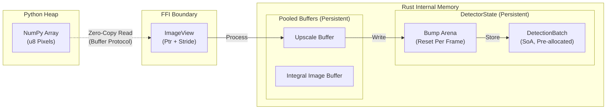
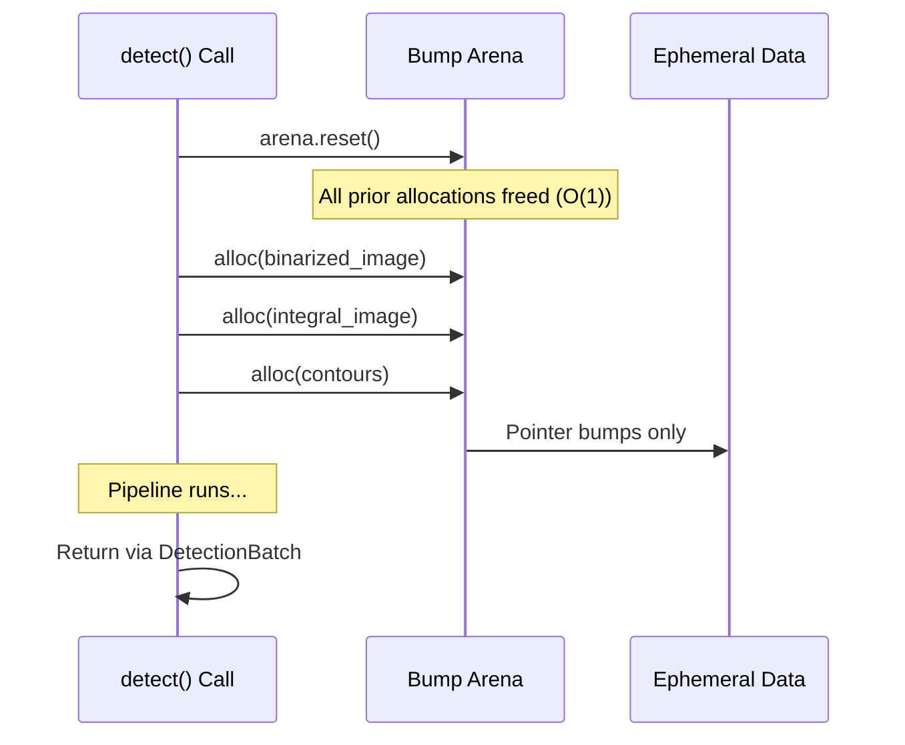
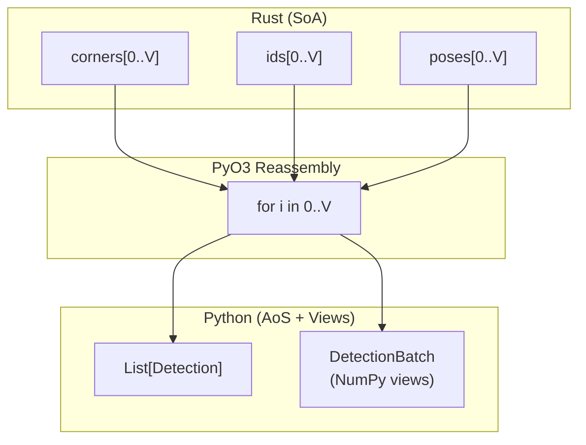

# Memory Model

This document details Locus's memory architecture: the Data-Oriented Design (DOD) philosophy, the Structure of Arrays (SoA) batch layout, zero-copy FFI boundaries, and the arena allocation lifecycle. For the pipeline data flow, see [Pipeline](pipeline.md). For the formal SoA contract, see [DetectionBatch Contract](../engineering/detection-batch-contract.md).

## Design Philosophy

Locus achieves sub-15 ms latency by treating memory as an explicit resource rather than delegating it to the system allocator. The hot path (`detect()`) executes **zero heap allocations** after initialization. All ephemeral per-frame data lives in a bump arena that is reset in $O(1)$ time at frame boundaries.

## Memory Hierarchy



### Allocation Classes

| Class | Lifetime | Strategy | Examples |
| :--- | :--- | :--- | :--- |
| **Persistent** | Detector lifetime | Pre-allocated at `Detector::new()` | `DetectionBatch`, upscale buffer, integral image buffer |
| **Per-Frame** | Single `detect()` call | Bump arena (`bumpalo::Bump`) | Binarized image, contours, intermediate SoA slices |
| **Stack** | Function scope | Fixed-size arrays, `SmallVec`, `arrayvec` | Homography matrices, sample buffers, ROI caches |

### Forbidden in the Hot Path

The following are **strictly forbidden** inside `detect()` (enforced by code review and CI):

- `Vec::new()`, `Box::new()`, `HashMap::new()` or any implicit heap allocation
- `String` formatting or dynamic dispatch that triggers allocation
- Growing any collection beyond its pre-allocated capacity

## The DetectionBatch (SoA Layout)

The `DetectionBatch` is the central data structure of the pipeline. It replaces discrete `Candidate` or `Quad` objects with a set of parallel arrays indexed by candidate ID. This eliminates pointer chasing and ensures SIMD-friendly memory access patterns.

### Data Layout

```
Index i    0         1         2         ...       N-1
           ┌─────────┬─────────┬─────────┬─────────┐
corners    │ [4×P2f] │ [4×P2f] │ [4×P2f] │   ...   │  32-byte aligned
           ├─────────┼─────────┼─────────┼─────────┤
homographies│ [3×3+pad]│ [3×3+pad]│ [3×3+pad]│   ...   │  64-byte aligned
           ├─────────┼─────────┼─────────┼─────────┤
ids        │  u32    │  u32    │  u32    │   ...   │
           ├─────────┼─────────┼─────────┼─────────┤
payloads   │  u64    │  u64    │  u64    │   ...   │
           ├─────────┼─────────┼─────────┼─────────┤
error_rates│  f32    │  f32    │  f32    │   ...   │
           ├─────────┼─────────┼─────────┼─────────┤
poses      │ Pose6D  │ Pose6D  │ Pose6D  │   ...   │  32-byte aligned
           ├─────────┼─────────┼─────────┼─────────┤
status_mask│  u8     │  u8     │  u8     │   ...   │
           ├─────────┼─────────┼─────────┼─────────┤
funnel_status│ u8    │  u8     │  u8     │   ...   │
           └─────────┴─────────┴─────────┴─────────┘
```

### The Identity Rule

The identity of a fiducial marker is defined by its **index**. If a quad exists at index 7, then `corners[7]`, `homographies[7]`, `ids[7]`, and `poses[7]` are guaranteed to belong to the same physical marker. There is no separate `Candidate` struct in the hot path.

### Capacity & Alignment

- **Fixed Pre-Allocation:** `MAX_CANDIDATES = 1024`. No runtime growth.
- **SIMD Alignment:** `corners` and `homographies` arrays are aligned to 32-byte boundaries for penalty-free AVX2 loads.
- **Cache Line Alignment:** `homographies` entries are padded to 64 bytes to prevent false sharing during parallel computation.

## Arena Lifecycle

The `bumpalo::Bump` arena provides $O(1)$ reset semantics. At the start of each frame, a single pointer reset frees all prior allocations without calling destructors or returning memory to the OS.



### Why Not Standard Allocation?

| Approach | Cost Per Frame | Fragmentation | Cache Behavior |
| :--- | :--- | :--- | :--- |
| `malloc`/`free` per object | $O(K)$ syscalls | Unbounded | Cold, scattered |
| Arena (bump) | $O(1)$ reset | Zero | Hot, sequential |

For a 50-tag frame producing ~200 intermediate allocations, the arena saves ~200 allocator round-trips per frame.

## Zero-Copy FFI Boundary

### Input Path (Python to Rust)

NumPy arrays are accessed via the Python Buffer Protocol (`PyReadonlyArray2<u8>`). The Rust side receives a raw pointer and stride, avoiding any copy of the pixel data.

**Validation (performed once at the FFI boundary):**

1. Array must be 2D with `dtype=uint8`.
2. `stride_x` must equal 1 (contiguous rows). Non-contiguous arrays raise `ValueError`.
3. SIMD kernels require **3 bytes of end-padding** for safe 32-bit gather operations.

### Output Path (Rust to Python)

At the end of `detect()`, a single reassembly loop iterates over valid indices `[0..V]` and reads horizontally across the SoA arrays to construct Python `Detection` dataclass instances. The `DetectionBatch` Python wrapper exposes zero-copy NumPy views of the internal SoA columns for vectorized downstream processing.



## Phase-Isolated Write Privileges

To enable lock-free parallelization, each pipeline phase has strict read/write privileges over the SoA columns. See the full contract in [DetectionBatch Contract](../engineering/detection-batch-contract.md).

| Phase | Reads | Writes |
| :--- | :--- | :--- |
| **A: Contour Extraction** | Image | `corners`, `status_mask`, `corner_covariances` |
| **B: Homography** | `corners`, `status_mask` | `homographies` |
| **B.5: Funnel** | Image, `corners` | `status_mask`, `funnel_status` |
| **C: Decoding** | Image, `homographies` | `ids`, `payloads`, `error_rates`, `status_mask`, `corners`¹ |
| **D: Pose** | `corners`, `status_mask`, `corner_covariances` | `poses` |

¹ Phase C's write to `corners` is restricted to a rotation-permutation (and optional sub-pixel refinement) — the four corner slots of a single index are cyclically re-labelled to reflect the decoded rotation, preserving the identity invariant. See `docs/engineering/detection-batch-contract.md §4 Phase C` and the enforcing test at `crates/locus-core/tests/contract_detection_batch.rs`.

This isolation guarantees that phases B and C can be parallelized via `rayon` without synchronization.

## Hybrid ROI Caching

During decoding, each tag candidate's image region is copied into a contiguous buffer before sampling to maximize L1 cache utilization:

- **Small tags** (ROI fits in ~4 KB): Stack-allocated buffer (`[u8; N]`).
- **Large tags** (ROI exceeds stack budget): Arena-allocated buffer.

This ensures that the SIMD bilinear interpolation kernel operates on sequential memory regardless of the original image stride.
