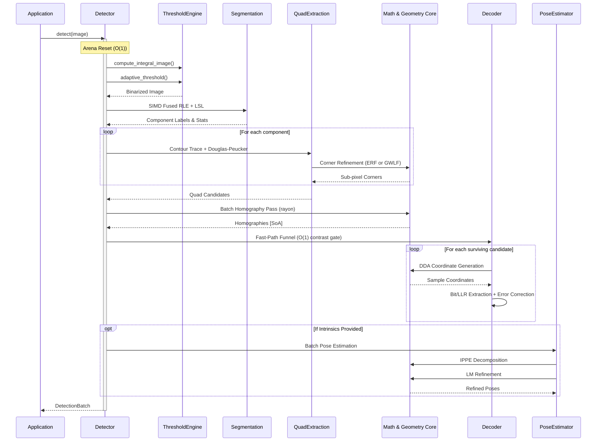

# Detection Pipeline

This document details the chronological data flow through the Locus detection pipeline. For memory layout and allocation strategy, see [Memory Model](memory_model.md). For the mathematical foundations of each solver, see [Algorithms](algorithms.md).

## Pipeline Overview

The pipeline follows a strict sequential-then-parallel execution model. Each stage operates on the shared [DetectionBatch (SoA)](../engineering/detection-batch-contract.md) with well-defined read/write privileges.

```mermaid
flowchart LR
    subgraph Preprocessing
        Integral["Integral Image"]
        Thresh["Adaptive Threshold"]
    end

    subgraph Segmentation
        RLE["SIMD Fused RLE"]
        LSL["Light-Speed Labeling"]
    end

    subgraph Geometry ["Math & Geometry Core"]
        Homog["Homography (DLT)"]
        ERF["ERF Sub-pixel"]
        GWLF["GWLF Sub-pixel"]
        IPPE["IPPE-Square"]
        LM["LM Solvers"]
    end

    subgraph QuadExtraction ["Quad Extraction"]
        Contour["Contour Tracing"]
        DP["Douglas-Peucker"]
        Refine["Corner Refinement"]
    end

    subgraph Decoding
        Funnel["Fast-Path Funnel"]
        Sample["Homography Sampling"]
        EC["Error Correction"]
    end

    subgraph PoseEst ["Pose Estimation"]
        PoseInit["IPPE Decomposition"]
        PoseRefine["LM Refinement"]
    end

    Integral --> Thresh
    Thresh --> RLE --> LSL
    LSL --> Contour --> DP --> Refine
    Refine -.->|ERF or GWLF| Geometry
    Refine --> Funnel --> Sample --> EC
    Sample -.->|DDA| Geometry
    EC --> PoseInit --> PoseRefine
    PoseInit -.->|IPPE| Geometry
    PoseRefine -.->|LM| Geometry
```

## Stage 0: Pre-allocation & Upscaling

At the start of each `detect()` call, the bump arena is reset in $O(1)$ time, freeing all per-frame ephemeral data. If the input image is below the minimum resolution threshold, it is upscaled into a pre-allocated buffer.

**Module:** `detector.rs`

## Stage 1: Preprocessing

Two linear passes over the image produce the binarized input for segmentation.

1. **Integral Image** — A single-pass $O(N)$ scan computes the prefix-sum table used by the adaptive thresholder.
2. **Adaptive Threshold** — Each pixel is compared against the local mean computed from the integral image over a configurable tile size. The output is a binary image where foreground pixels indicate potential tag edges.

**Module:** `threshold.rs` | **Complexity:** $O(N)$ | **Typical Latency:** ~0.9 ms (720p)

## Stage 2: Segmentation (SIMD Fused)

Connected components labeling identifies contiguous foreground regions.

1. **Run-Length Encoding (RLE)** — A SIMD-accelerated pass (`multiversion` dispatch to AVX2/NEON) extracts horizontal runs from the binary image.
2. **Light-Speed Labeling (LSL)** — A single-pass 1D algorithm resolves equivalences between runs using a union-find structure, producing labeled components with bounding-box statistics.

Components below the minimum area threshold are discarded immediately.

**Module:** `simd_ccl_fusion.rs`, `segmentation.rs` | **Complexity:** $O(N)$ | **Typical Latency:** ~0.5 ms (720p)

## Stage 3: Quad Extraction

For each surviving component, the pipeline extracts and refines quadrilateral candidates.

### 3a. Contour Tracing

A boundary-following algorithm traces the outer contour of each labeled component, producing an ordered chain of pixel coordinates.

### 3b. Polygon Approximation (Douglas-Peucker)

The contour is simplified to a polygon. Only quadrilaterals (exactly 4 vertices after simplification) survive this gate.

### 3c. Corner Refinement

Sub-pixel corner localization is applied via one of two strategies (selected by `CornerRefinementMode`):

| Mode | Algorithm | Module |
| :--- | :--- | :--- |
| **ERF** | Gauss-Newton fit of a PSF-blurred step function along edge normals. | `edge_refinement.rs` |
| **GWLF** | Gradient-weighted orthogonal distance regression (PCA) with algebraic line intersection in homogeneous coordinates. Propagates full $3 \times 3$ line covariances to $2 \times 2$ corner covariances. | `gwlf.rs` |

Both strategies share the centralized `erf_approx` / `erf_approx_v4` SIMD kernels from `simd::math`.

**Module:** `quad.rs`, `edge_refinement.rs`, `gwlf.rs` | **Complexity:** $O(K \cdot M)$ | **Typical Latency:** ~1.5 ms (720p, 50 tags)

## Stage 4: Homography & Decoding

### 4a. Homography Pass

For each active quad, a `square_to_quad` homography is computed mapping the canonical unit square $[(-1,-1), (1,-1), (1,1), (-1,1)]$ to the detected image corners. This is a batch SoA operation parallelized via `rayon`.

**Module:** `homography.rs`

### 4b. Fast-Path Funnel

Before expensive bit sampling, an $O(1)$ contrast gate rejects candidates lacking photometric evidence of a tag edge. The gate samples a small number of pixels along each edge using the DDA (Digital Differential Analyzer) and checks for sufficient intensity contrast.

**Module:** `funnel.rs`

### 4c. Bit Sampling & Decoding

For surviving candidates, the homography DDA incrementally generates sample coordinates in image space. Two strategies are available:

| Strategy | Mechanism | Module |
| :--- | :--- | :--- |
| **Hard-Decision** | Direct intensity thresholding. $O(1)$ dictionary lookup via precomputed tables. | `decoder.rs`, `strategy.rs` |
| **Soft-Decision** | Log-Likelihood Ratio (LLR) extraction with Maximum Likelihood search via Multi-Index Hashing (MIH). Sub-linear dictionary search. | `decoder.rs`, `strategy.rs` |

Sampling uses SIMD-accelerated bilinear interpolation with hardware reciprocal approximation (`rcp_nr`) and vectorized FMA. The ROI caching system copies small-tag regions to contiguous stack buffers (or arena buffers for large tags) to minimize L1 cache misses.

**Module:** `decoder.rs` | **Complexity:** $O(Q)$ | **Typical Latency:** ~10.0 ms (720p, 50 tags)

## Stage 5: Pose Estimation (Optional)

When camera intrinsics are provided, a 6-DOF pose is recovered for each valid tag.

### 5a. IPPE Decomposition

The homography is normalized by the inverse intrinsics matrix and decomposed via the IPPE-Square analytical solution, yielding two candidate poses. The candidate with lower reprojection error is selected.

### 5b. Levenberg-Marquardt Refinement

The selected pose is refined iteratively. Two modes are available:

| Mode | Objective | Uncertainty | Module |
| :--- | :--- | :--- | :--- |
| **Fast** | Huber-robust geometric reprojection error (pixel distance). | None. | `pose.rs` |
| **Accurate** | Huber-robust Mahalanobis distance using per-corner $2 \times 2$ information matrices from the Structure Tensor or GWLF covariance propagation. | Full $6 \times 6$ pose covariance (Cramer-Rao bound). | `pose_weighted.rs` |

Both solvers use Nielsen trust-region scheduling with Marquardt diagonal scaling.

**Module:** `pose.rs`, `pose_weighted.rs` | **Complexity:** $O(V)$ | **Typical Latency:** ~0.05-0.2 ms per tag

## Stage 6: Board-Level Pose Estimation (Optional)

When a board topology is provided alongside the decoded tags, a single 6-DOF board pose is estimated from the full set of visible markers. Two board types are supported, each following a distinct pipeline branch.

### 6a. AprilGrid (`BoardEstimator`)

Treats each visible tag's four corners as independent 3D point correspondences:

1. **Correspondence assembly** — For each valid tag, look up its 3D corner coordinates in `AprilGridTopology::obj_points` and pair them with the refined image corners from the batch. Per-corner information matrices from Stage 5b are carried forward.
2. **Seed pose selection** — Each tag's Stage-5 individual pose is converted from tag-local to board-frame as a starting hypothesis for the solver.
3. **LO-RANSAC + AW-LM** — `RobustPoseSolver` runs LO-RANSAC over all tag-corner correspondences (grouped by tag, `group_size=4`) followed by anisotropically-weighted Levenberg-Marquardt refinement. Returns the board pose and full $6 \times 6$ covariance.

**Module:** `board.rs` | **Struct:** `BoardEstimator` | **Complexity:** $O(V)$

### 6b. ChAruco (`CharucoRefiner`)

Uses the *interior checkerboard corners* (saddle points) rather than tag corners for higher precision — saddles are sharp image features localizable to sub-pixel accuracy:

1. **Saddle prediction via homography extrapolation** — For each visible tag, look up its adjacent saddle IDs from `CharucoTopology::tag_cell_corners`. Each saddle lies at the outer corner of the tag's *enclosing square*, beyond the tag boundary by the padding margin `(square_length − marker_length) / 2`. The tag's stored homography is applied to canonical coordinates with `|u| > 1` or `|v| > 1` (intentional extrapolation) to predict the saddle's image location.
2. **Deduplication** — Saddles shared by adjacent tags are deduplicated in O(V) using a pre-allocated boolean scratch array.
3. **Gauss-Newton saddle refinement** — Each predicted saddle is refined with up to 5 Newton steps using the structure tensor as a surrogate Hessian:
$$\delta\mathbf{p} = -\mathbf{S}^{-1} \nabla I(\mathbf{p}), \qquad \mathbf{S} = \sum_{\mathcal{W}} \nabla I \nabla I^T$$
   Saddles that drift more than `max_drift_px` from the prediction, or where $\det(\mathbf{S}) < 10^{-3}$, are rejected.
4. **LO-RANSAC + AW-LM** — `RobustPoseSolver` runs over the accepted saddles with `group_size=1` (each saddle is an independent point), yielding the board pose and covariance.

**Module:** `charuco.rs` | **Struct:** `CharucoRefiner` | **Complexity:** $O(V + S_\text{accepted})$ | **Allocations:** zero inside `estimate()`

!!! note "Why saddles, not tag corners?"
    Tag corners are at the boundary of the ArUco marker (Layer A). Saddle points are at the outer corners of the *enclosing black square* (Layer B), which is a sharper, unambiguous image feature and is independent of the tag's own corner quality. The white padding margin between a tag's edge and its enclosing square is precisely `(square_length − marker_length) / 2`.

## End-to-End Sequence

## Performance Budget

| Stage | Complexity | Latency (50 Tags, 720p) | Notes |
| :--- | :--- | :--- | :--- |
| **Preprocessing** | $O(N)$ | ~0.9 ms | Adaptive thresholding + Integral Image. |
| **Segmentation** | $O(N)$ | ~0.5 ms | SIMD Fused RLE + Light-Speed Labeling. |
| **Quad Extraction** | $O(K \cdot M)$ | ~1.5 ms | SoA extraction + sub-pixel refinement. |
| **Decoding (Hard)** | $O(Q)$ | ~10.0 ms | SoA math pass; SIMD bilinear sampling. |
| **Pose Refinement** | $O(V)$ | ~0.2 ms | Partitioned solver (valid tags only). |
| **Board Pose (AprilGrid)** | $O(V)$ | ~0.5 ms | LO-RANSAC + AW-LM over tag corners. |
| **Board Pose (ChAruco)** | $O(V + S)$ | ~0.8 ms | Saddle prediction + GN refinement + LO-RANSAC. |

*Total (detection only): ~14.5 ms for 50 tags (720p) on a modern desktop CPU (e.g., Zen 4).*
