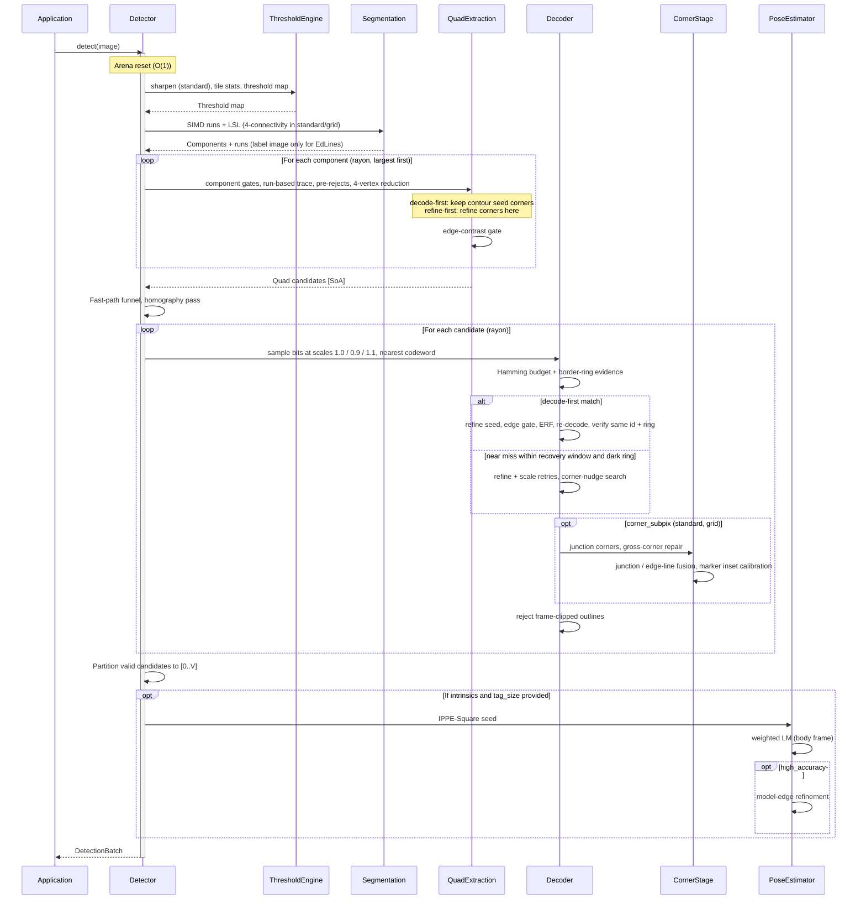

# Detection Pipeline

This document details the chronological data flow through the Locus detection pipeline. For memory layout and allocation strategy, see [Memory Model](memory_model.md). For the mathematical foundations of each solver, see [Algorithms](algorithms.md). The source of truth is `run_detection_pipeline` in `crates/locus-core/src/detector.rs`; the shipped settings referred to below are the JSON profiles in `crates/locus-core/profiles/`.

## Pipeline Overview

The pipeline follows a strict sequential-then-parallel execution model. Each stage operates on the shared [DetectionBatch (SoA)](../engineering/detection-batch-contract.md) with well-defined read/write privileges.

```mermaid
flowchart LR
    subgraph Preprocessing
        Sharpen["Laplacian Sharpening<br/>(standard)"]
        TileStats["Tile Statistics"]
        Thresh["Threshold Map"]
    end

    subgraph Segmentation
        RLE["SIMD Run Extraction"]
        LSL["Light-Speed Labeling"]
    end

    subgraph QuadExtraction ["Quad Extraction"]
        Gates["Component Gates"]
        Trace["Run-based Contour Trace"]
        Reduce["Pre-rejects + 4-vertex Reduction"]
        EdgeGate["Edge-contrast Gate"]
    end

    subgraph Decoding
        Funnel["Fast-Path Funnel"]
        Homog["Homography Pass"]
        Sample["Bit Sampling + Nearest Codeword"]
        Ring["Border-ring Evidence"]
        Verify["Refine + Re-decode<br/>(decode-first)"]
        Recovery["Near-miss Recovery"]
    end

    subgraph Corners ["Corner Stage (corner_subpix)"]
        Junction["Junction Corners"]
        Repair["Gross-corner Repair"]
        Fuse["Junction / Edge-line Fusion"]
        Inset["Marker Inset Calibration"]
        Clip["Frame-clipped Rejection"]
    end

    subgraph PoseEst ["Pose Estimation (optional)"]
        PoseInit["IPPE-Square"]
        PoseRefine["Weighted LM"]
        ModelEdge["Model-edge Refinement<br/>(high_accuracy)"]
    end

    Sharpen --> TileStats --> Thresh --> RLE --> LSL
    LSL --> Gates --> Trace --> Reduce --> EdgeGate
    EdgeGate --> Funnel --> Homog --> Sample --> Ring
    Ring --> Verify
    Ring -.->|near miss| Recovery
    Verify --> Junction --> Repair --> Fuse --> Inset --> Clip
    Recovery --> Junction
    Clip --> PoseInit --> PoseRefine --> ModelEdge
```

## What each shipped profile runs

| Stage | `standard` (default) | `grid` | `high_accuracy` |
| :--- | :--- | :--- | :--- |
| Sharpening | on | off | off |
| Threshold | `TileMidExtreme` | `TileMidExtreme` | `TileMidExtreme` |
| Connectivity | 4 | 4 | 8 |
| Blob-shape gates (fill / density / elongation) | off | on | on |
| Quad extraction | `ContourRdp` | `ContourRdp` | `AdaptivePpb`: `EdLines` for well-resolved tags, `ContourRdp` + ERF below 2.5 px per bit |
| Ordering | decode-first | decode-first | refine, then decode |
| Border-ring check | per-family budget | per-family budget | off |
| `decoder.corner_subpix` (junction/edge fusion, repair, inset calibration) | on | on | off |
| Model-edge pose refinement | off | off | on |

Frame-clipped rejection runs in every profile. The corner stage and the frame-clipped check belong to the pinhole decode path; the distortion-aware path (`non_rectified` build, intrinsics with a distortion model) decodes with the ring check but runs neither.

## Stage 0: Pre-allocation & Resampling

At the start of each `detect()` call, the bump arena is reset in $O(1)$ time, freeing all per-frame ephemeral data. With `decimation > 1` the image is area-decimated into an arena buffer; with `upscale_factor > 1` it is upscaled into a persistent buffer. Corners found on the resampled grid are mapped back to the original image, which every later stage (decoding, corner refinement, pose) samples. The shipped profiles run at native resolution.

**Module:** `detector.rs`, `image.rs`

## Stage 1: Preprocessing

1. **Sharpening** *(`standard`)* — an optional Laplacian sharpening pass into an arena buffer (`filter.rs`).
2. **Tile statistics** — a single $O(N)$ pass reduces each `tile_size × tile_size` tile to its min and max.
3. **Threshold map** — `threshold.mode` selects the rule. Segmentation reads the per-pixel threshold map: a pixel is foreground when `pixel < threshold_map[pixel]`, so a threshold of `0` means "never foreground".
    - `TileMidExtreme` *(every shipped profile)* — `min + 9/20 · (max − min)` over the tile's 3×3 tile neighbourhood, rounded; `threshold::CUT_NUM`/`CUT_DEN` carry the fraction and the measurement behind it. Cheap and well suited to rectified, well-lit scenes.

        The cut sits **below** the midpoint, which is where this mode used to cut and what its name records. The midpoint is the unbiased cut for an edge the optics resolved, but this map answers a question about *topology*, not geometry: segmentation reads it to decide which pixels are one marker, while corners come from the grey-scale refinement, which never reads it. A bright separation narrower than the point-spread function never reaches the bright level, so at the midpoint it falls on the dark side and the markers either side arrive as one connected component — which is traced once and reduced to one quadrilateral, losing both. Cutting at 9/20 shrinks every dark region by a fraction of the blur width and holds those separations open (EuRoC `cam_april` recall 86.0 → 92.0 %, Liu4K 37.2 → 44.8 %, 2026-10-05).

        The two failure modes are symmetric and a single scalar must choose between them: cut too high and thin bright separations are swallowed (markers fuse), cut too low and thin dark strokes erode (markers shatter, costing small markers their one-module borders below about 0.42). Because it follows the local *extremes*, a flat tile also gets `t` at or just above its own grey level, so sensor noise speckles uniform regions (see the [recall lessons](../engineering/lessons/recall-quad-icra.md)).
    - `LocalMean` *(opt-in)* — a per-pixel local mean over a `(2·local_mean_radius + 1)²` window minus an offset. It tracks the local *background level* instead of the local extremes. Computed with a sliding column-sum accumulator (one `u32` row per row-strip), not an integral image, so the result is independent of the strip size and of the rayon worker count.

**Module:** `threshold.rs`, `filter.rs` | **Complexity:** $O(N)$

## Stage 2: Segmentation

Connected-component labeling identifies contiguous dark regions.

1. **Run extraction** — a SIMD pass (`multiversion` dispatch to AVX2/NEON) extracts horizontal foreground runs from the threshold map (in parallel row strips when the pool has more than one worker).
2. **Light-Speed Labeling (LSL)** — union-find over runs resolves equivalences and accumulates per-component statistics (bounding box, pixel count, moments) and each component's runs.

**Connectivity** is `segmentation.connectivity`. `standard` and `grid` use **4-connectivity** (as AprilTag 3 does for dark regions): marker squares that touch only at a corner — AprilGrid connectors, checkerboard cells — stay separate components. 8-connectivity (`high_accuracy`) links diagonal contacts. The trade-off is measured in the [2026-10-04 EuRoC report](../engineering/benchmarking/euroc_sota_20261004.md).

Components below `quad.min_area` are discarded. A full-frame **label image** is written only when some route can use `EdLines`; the `ContourRdp` path traces boundaries directly from each component's runs.

**Module:** `simd_ccl_fusion/`, `segmentation.rs` | **Complexity:** $O(N)$

## Stage 3: Quad Extraction

Components are processed in parallel, largest first (the order is load-bearing for deterministic deduplication). Survivors are truncated to `MAX_CANDIDATES` only after the geometric gates.

### 3a. Component gates

Cheap tests on the component statistics: bounding-box area between `quad.min_area` and 90 % of the image; at least the **smallest filled area that can hold a decodable marker** of the active families (49 px² for 36h11 / ArUcoMip36h12 / 6x6, 25 px² for 16h5 / 4x4); `quad.max_aspect_ratio`; the pixel-fill band `[min_fill_ratio, max_fill_ratio]`; and optional moment gates (`max_elongation`, `min_density`).

`standard` turns the blob-shape gates off (`min_fill_ratio`, `min_density`, `max_elongation` = 0): they assume a filled blob and reject hollow rings and markers merged with neighbouring structure. It judges candidates by marker evidence (border ring, codeword budget) instead. `grid` and `high_accuracy` keep them.

### 3b. Contour tracing and reduction (`ContourRdp`)

1. **Run-based trace** — the outer boundary is traced from the component's runs (no label-image lookups).
2. **Contour pre-rejects** — before the $O(n \log n)$ vertex selection, a contour is dropped if its enclosed area (Pick's theorem on the traced pixel centres) is below the minimum marker fill, or its isoperimetric compactness $4\pi A / L^2$ is below half the quad floor. Ragged texture outlines fail here, which skips their simplification — the most expensive case.
3. **Reduction to four vertices** — chain approximation, then selection of the four dominant vertices; the quad must clear `quad.min_area` and a compactness floor of 0.1. Corners are expanded 0.5 px outward to the pixel boundary and must satisfy `quad.min_edge_length`.

### 3b'. `EdLines` (high_accuracy, well-resolved tags)

Angular arc boundary on the label image → Huber IRLS line fits → sub-pixel gradient parabola → joint Gauss-Newton over the eight corner coordinates, which also yields per-corner covariances. See [EdLines lessons](../engineering/lessons/edlines-segmentation.md).

### 3c. Refinement and the edge-contrast gate

**Decode-first ordering** (the ERF refinement route at native resolution: `standard`, `grid`) keeps the contour corners as *seeds*: only candidates that decode, or nearly do, are refined later in Stage 4. Every other route refines here:

| Mode | Algorithm | Module |
| :--- | :--- | :--- |
| **ERF** | Gauss-Newton fit of a PSF-blurred step along each edge normal, corners from line intersections. | `edge_refinement.rs`, `refinement.rs` |
| **None** | Pass-through (EdLines corners are already sub-pixel). | `refinement.rs` |

The quad must then show edge contrast above `quad.min_edge_score`. An unrefined seed sits up to about a pixel off a sharp edge, so the gate searches a ±1 px band across each edge for seeds and only the chord for refined quads.

**Module:** `quad.rs`, `edlines.rs`, `refinement.rs`, `edge_refinement.rs`

## Stage 4: Funnel, Homography & Decoding

### 4a. Fast-path funnel

Before bit sampling, an $O(1)$ contrast gate rejects candidates lacking photometric evidence of a tag edge at the edge midpoints (`decoder.min_contrast`, against the tile statistics). Skipped under lens distortion, where an edge midpoint can fall inside the tag.

**Module:** `funnel.rs`

### 4b. Homography pass

For each active quad, a `square_to_quad` homography maps the canonical square $[(-1,-1), (1,-1), (1,1), (-1,1)]$ to the image corners. Batch SoA pass parallelized via `rayon`.

**Module:** `decoder.rs` (`compute_homographies_soa`)

### 4c. Bit sampling and dictionary decode

Each candidate's region is copied into a contiguous ROI cache (stack buffer for small tags, arena for large ones). Bit cells are sampled at their centres through the homography (DDA coordinate generation, SIMD bilinear interpolation with `rcp_nr`), binarized against per-cell adaptive thresholds, and matched to every registered family's dictionary. The match is a **branch-free popcount scan** of `hamming << 16 | index` keys over all four rotations of every code: the minimum is the nearest codeword (lowest index on ties). There are no precomputed Hamming tables; a multi-index-hash path exists only for payloads above 36 bits, which no shipped family uses. Each candidate is tried at quad scales 1.0, 0.9 and 1.1; the lowest Hamming distance across families wins.

**Module:** `decoder.rs`, `dictionaries.rs`, `strategy.rs`

### 4d. Border-ring evidence

A match within the family's Hamming budget must also show the marker's **dark border ring**: the `4·(d + 1)` ring cells around a `d × d` payload are sampled through the homography of the reported (unscaled) quad, and at most `decoder.max_border_error_rate` of them may read bright. The default (`None`) is the family's own error density, `max_hamming / bit_count` (for 36h11: 2/36, i.e. one ring cell in 28). `high_accuracy` disables the check (rate 1.0). Texture that happens to land near a codeword rarely has a uniformly dark ring.

### 4e. Decode-first verification

Under decode-first ordering a match from seed corners is provisional. The candidate gets the refinement Stage 3 skipped — quad-stage corner refinement, the edge-contrast gate, then the decoder's ERF pass — and is re-decoded at the scale that matched. It is accepted only if the refined quad decodes the **same id** within the budget and passes the ring check with the full budget (the seed itself is checked with the looser recovery tolerance, since seed ring samples can land in the white surround). Otherwise the match is discarded. Refine-first ordering instead re-decodes the ERF-refined finalist and keeps the refined corners if the id holds and the distance is not worse.

### 4f. Near-miss recovery

A candidate whose best distance exceeds the budget but lies within the family's **recovery window** gets a second chance. The window is the largest Hamming distance that uniformly random bits reach with probability at most 0.1 (union bound over every rotated code): 6 for 36h11 and ArUcoMip36h12, 1 for 16h5, 0 for ArUco 4x4_100. Recovery also requires the seed to show a dark ring (at most 20 % bright cells), which skips most texture near-misses. It runs the decode-first refinement with the scale retries, then a coarse corner-nudge search (±0.2 px, two passes); any acceptance still needs the full ring budget.

**Module:** `decoder.rs` | **Complexity:** $O(Q)$

## Stage 5: Corner Stage (`decoder.corner_subpix`)

On every decoded marker (`standard`, `grid`), the accepted corners are re-estimated. See [Algorithms §2.5–2.6](algorithms.md#25-gradient-orthogonality-corners-and-whole-edge-fusion) for the models.

1. **Junction corners** — a gradient-orthogonality fit (the `cv::cornerSubPix` model) at each corner, tried at window half-widths of 0.3, 0.5 and 0.75 cell (clamped to 2–4 px); the largest window that is not significantly less certain than the best is kept. A result is kept only if the image around it still shows the corner of this marker's black border. Markers with cells under ~3.3 px keep their seeds.
2. **Gross-corner repair** — a corner the junction model rejects while both neighbours pass is usually far from the marker corner (quad extraction cut across a blurred apex or a touching square). It is re-placed from its two edges, fitted next to the good neighbours, and confirmed by the junction model; the sweep repeats until nothing changes.
3. **Junction / edge-line fusion** *(undistorted images)* — each L-corner is combined, by inverse covariance, with the intersection of its two whole-edge line fits. All four corners or none; at X-junctions (AprilGrid connectors) the junction estimate stands alone.
4. **Marker inset calibration** *(undistorted images)* — the decoded marker's own bit boundaries measure the photometric edge shift and the corners' inset, and the corners move outward by it (`marker_inset.rs`).

`corner_refined` records which corners the junction pass placed (the board pose models the two estimators separately). Steps 3–4 need an undistorted image (no intrinsics, or intrinsics without a distortion model); with a distortion model that the build does not route to the distortion-aware path, steps 1–2 still run. The distortion-aware decode path runs none of this stage.

**Module:** `refinement.rs`, `marker_inset.rs`

## Stage 6: Frame-clipped Rejection

A marker cut by the image frame reports the frame edge as one of its sides and a clipped corner. On the pinhole decode path, every profile rejects a decoded outline unless every corner lies in the image and every side's midpoint is at least the smallest corner window's reach (3 px) from the border. A corner may touch the border: its two edges still place it.

**Module:** `decoder.rs` (`outline_observed`)

## Stage 7: Pose Estimation (Optional)

After partitioning valid candidates to the front `[0..V]`, a 6-DOF pose is recovered for each when camera intrinsics and `tag_size` are provided.

1. **IPPE-Square** — the homography normalized by $K^{-1}$ is decomposed analytically into two candidate poses; the one with lower reprojection error seeds the solver.
2. **Levenberg-Marquardt refinement** — body-frame (right-perturbation) LM with Nielsen trust-region scheduling. With the image available (the detector path), it minimizes a Huber-robust Mahalanobis cost using per-corner $2 \times 2$ information matrices from the structure tensor and returns a $6 \times 6$ covariance; pose-only refits without an image fall back to unweighted Huber LM.
3. **Model-edge refinement** *(`high_accuracy`)* — the pose is refined against the decoded marker's internal bit-grid edges (rotation), with translation re-anchored to the corners.

**Module:** `pose.rs`, `pose_weighted.rs`, `model_edge.rs` | **Complexity:** $O(V)$

## Stage 8: Board-Level Pose Estimation (Optional)

When a board topology is provided alongside the decoded tags, a single 6-DOF board pose is estimated from the full set of visible markers. Two board types are supported, each following a distinct pipeline branch.

### 8a. AprilGrid (`BoardEstimator`)

Treats each visible tag's four corners as independent 3D point correspondences:

1. **Correspondence assembly** — For each valid tag, look up its 3D corner coordinates in `AprilGridTopology::obj_points` and pair them with the refined image corners from the batch. Per-corner information matrices from Stage 7 are carried forward.
2. **Seed pose selection** — Each tag's individual pose is converted from tag-local to board-frame as a starting hypothesis for the solver.
3. **LO-RANSAC + AW-LM** — `RobustPoseSolver` runs LO-RANSAC over all tag-corner correspondences (grouped by tag, `group_size=4`) followed by anisotropically-weighted Levenberg-Marquardt refinement. Returns the board pose and full $6 \times 6$ covariance.
4. **Photometric inset** — the board LM alternates with a per-frame estimate of the marker-corner inset, one per corner estimator (see [Algorithms §2.6](algorithms.md#26-marker-photometric-inset-calibration)).

**Module:** `board.rs` | **Struct:** `BoardEstimator` | **Complexity:** $O(V)$

### 8b. ChAruco (`CharucoRefiner`)

Uses the *interior checkerboard corners* (saddle points) rather than tag corners for higher precision — saddles are sharp image features localizable to sub-pixel accuracy:

1. **Saddle prediction via homography extrapolation** — For each visible tag, look up its adjacent saddle IDs from `CharucoTopology::tag_cell_corners`. Each saddle lies at the outer corner of the tag's *enclosing square*, beyond the tag boundary by the padding margin `(square_length − marker_length) / 2`. The tag's stored homography is applied to canonical coordinates with `|u| > 1` or `|v| > 1` (intentional extrapolation) to predict the saddle's image location.
2. **Deduplication** — Saddles shared by adjacent tags are deduplicated in O(V) using a pre-allocated boolean scratch array.
3. **Structure-tensor gate** — The homography prediction (step 1) is sub-pixel by construction; iterative refinement is empirically inert on this corpus (Newton step quenched by structure-tensor scaling; the principled Förstner replacement regresses pose by 4.5× on `regression_board_hub::board_charuco_v1_golden_forstner`). What is retained is the structure-tensor determinant — saddles with $\det(\mathbf{S}) < 10^{-3}$ over the $(2r+1)^2$ window (flat / low-conditioning neighborhoods) are rejected.
4. **LO-RANSAC + AW-LM** — `RobustPoseSolver` runs over the accepted saddles with `group_size=1` (each saddle is an independent point), yielding the board pose and covariance.

**Module:** `charuco.rs` | **Struct:** `CharucoRefiner` | **Complexity:** $O(V + S_\text{accepted})$ | **Allocations:** zero inside `estimate()`

!!! note "Why saddles, not tag corners?"
    Tag corners are at the boundary of the ArUco marker (Layer A). Saddle points are at the outer corners of the *enclosing black square* (Layer B), which is a sharper, unambiguous image feature and is independent of the tag's own corner quality. The white padding margin between a tag's edge and its enclosing square is precisely `(square_length − marker_length) / 2`.

## End-to-End Sequence

```mermaid
sequenceDiagram
    participant App as Application
    participant Det as Detector
    participant Thresh as ThresholdEngine
    participant Seg as Segmentation
    participant Quad as QuadExtraction
    participant Decode as Decoder
    participant Corner as CornerStage
    participant Pose as PoseEstimator

    App->>Det: detect(image)
    activate Det

    Note over Det: Arena reset (O(1))

    Det->>Thresh: sharpen (standard), tile stats, threshold map
    Thresh-->>Det: Threshold map

    Det->>Seg: SIMD runs + LSL (4-connectivity in standard/grid)
    Seg-->>Det: Components + runs (label image only for EdLines)

    loop For each component (rayon, largest first)
        Det->>Quad: component gates, run-based trace, pre-rejects, 4-vertex reduction
        Note over Quad: decode-first: keep contour seed corners<br/>refine-first: refine corners here
        Quad->>Quad: edge-contrast gate
    end
    Quad-->>Det: Quad candidates [SoA]

    Det->>Det: Fast-path funnel, homography pass

    loop For each candidate (rayon)
        Det->>Decode: sample bits at scales 1.0 / 0.9 / 1.1, nearest codeword
        Decode->>Decode: Hamming budget + border-ring evidence
        alt decode-first match
            Decode->>Decode: refine seed, edge gate, ERF, re-decode, verify same id + ring
        else near miss within recovery window and dark ring
            Decode->>Decode: refine + scale retries, corner-nudge search
        end
        opt corner_subpix (standard, grid)
            Decode->>Corner: junction corners, gross-corner repair
            Corner->>Corner: junction / edge-line fusion, marker inset calibration
        end
        Decode->>Decode: reject frame-clipped outlines
    end

    Det->>Det: Partition valid candidates to [0..V]

    opt If intrinsics and tag_size provided
        Det->>Pose: IPPE-Square seed
        Pose->>Pose: weighted LM (body frame)
        opt high_accuracy
            Pose->>Pose: model-edge refinement
        end
    end

    Det-->>App: DetectionBatch
    deactivate Det
```

## Latency

Per-stage latency depends on the image, the marker count and the profile; current end-to-end numbers per benchmark (1 thread, verified hardware) are in the [2026-10-04 EuRoC report](../engineering/benchmarking/euroc_sota_20261004.md#latency) and the [2026-10-04 scoreboard](../engineering/benchmarking/sota_scoreboard_20261004.md). For per-stage timing, use the `tracing` spans (see [Benchmarking](../engineering/benchmarking.md)).

!!! note "Historical per-stage budget (April 2026)"
    An April 2026 estimate for 50 tags at 720p on a desktop CPU put preprocessing at ~0.9 ms, segmentation ~0.5 ms, quad extraction ~1.5 ms, decoding ~10 ms and pose ~0.2 ms (~14.5 ms total). It predates decode-first ordering, 4-connectivity and the corner stage, and is kept only for context.
